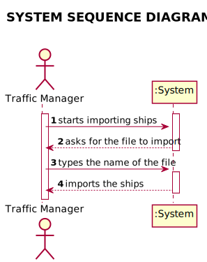
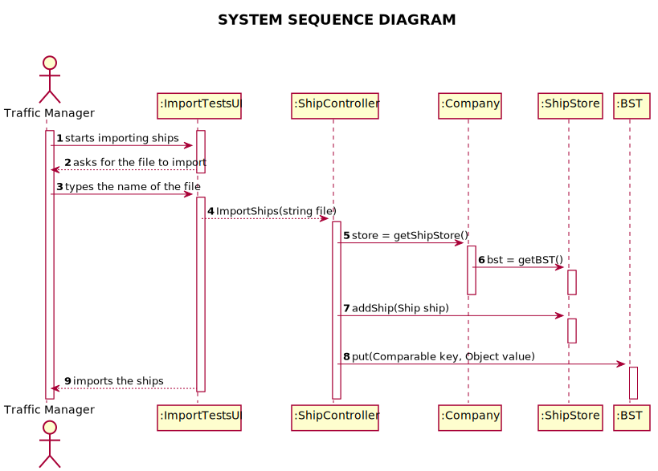
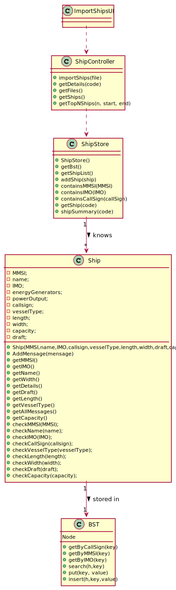

# US 101 - Import Ships

## 1. Requirements Engineering

### 1.1. User Story Description

*As a traffic manager, I which to import ships from a text file into a BST.*

### 1.2. Customer Specifications and Clarifications

* From the client clarifications:
* > Question: What is the attribute that should be used for sorting the ships on the Tree?
* > Answer: For any of its codes: MMSI, IMO or Call Sign

* > Question: When you say "no data lost", what do you mean?
* > Answer: That all data should be considered.

* > Question: We came across a question while working on this particular issue. While importing the ships, you pretend only to import the ship information or to associate already the movements made by the ships?
* > Answer: As you wish, provided that you can answer the requested user stories.

* > Question: Nos requisitos de aceitação de ESINF na US101 dita explicitamente que não deveriam ser perdidos dados ao importar informação. No enatnto, nos ficheros de excel com as informações dos navios aparecem varios dados considerados invalidos, incluindo 2 navios no ficheiro "sships.csv" em que Heading é sempre 511, valor este dito para indicar 'not available'. Devemos guardar todos os dados mesmo sendo inválidos ou devemos avisar o utilizador ou devemos lidar com a situaçao de forma diferente?
* > Answer: pode descartar registos inválidos

### 1.3. System Sequence Diagram (SSD)

*Insert here a SSD depicting the envisioned Actor-System interactions and throughout which data is inputted and outputted to fulfill the requirement. All interactions must be numbered.*

## 3. Design - User Story Realization

## 3.1. Sequence Diagram (SD)

*In this section, it is suggested to present an UML dynamic view stating the sequence of domain related software objects' interactions that allows to fulfill the requirement.*

## 3.2. Class Diagram (CD)

*In this section, it is suggested to present an UML static view representing the main domain related software classes that are involved in fulfilling the requirement as well as and their relations, attributes and methods.*

# 4. Tests

**Test 1:** Checks if the list of files in the files folder is returned correctly so the user can choose one.

    @Test
    void testGetFiles() {
        assertEquals(10, (new ShipController()).getFiles().size());
    }

**Test 2:** Check if all Ships were imported correctly

    @Test
    void testImportShips() {
        (new ShipController()).importShips("files/sships.csv");
        assertTrue(App.getInstance().getCompany().getShipStore().getShipList().size()==26);
    }

**Test 3:** Check if put method in BST is working

    @Test
    public void put() {
        Ship ship1 = new Ship(123456289, "CargoFest", "IMO1234567", "123XY", "1234", 5.5, 4.5, 100.3, "100");
        bstMMSI.put(123456289, ship1);
        Assert.assertEquals(ship1, bstMMSI.search(123456289));
    }

**Test 4:** Check if getByCallSign is searching well in Binary Search Tree

    @Test
    public void getByCallSignWrong() {
        Assert.assertNotEquals(ship, bstCallSign.search("123YY"));
    }

# 5. Construction (Implementation)

**ImportShips** Method in ShipController

    public void importShips(String file) {
        print("\n" + TextUtils.ANSI_GREEN + "Importing Ships . . ." + TextUtils.ANSI_BLUE + "\n");
        File file1 = new File(file);
        int count = 0;
        try {
            Scanner scanner = new Scanner(file1);
            scanner.nextLine();
            while (scanner.hasNextLine()) {
                String line = scanner.nextLine();
                String lineArray[] = line.split(",");

                int MMSI = Integer.parseInt(lineArray[0]);

                DateTimeFormatter formatter = DateTimeFormatter.ofPattern("dd/MM/yyyy HH:mm");
                LocalDateTime localDateTime = LocalDateTime.parse(lineArray[1], formatter);

                double latitude = Double.parseDouble(lineArray[2]);
                double longitude= Double.parseDouble(lineArray[3]);
                double sog= Double.parseDouble(lineArray[4]);
                double cog= Double.parseDouble(lineArray[5]);
                if (cog<0 && cog>-359){
                    cog = cog*(-1);
                }
                if (cog>359){
                    throw new IllegalArgumentException("Cog must be in this interval: [0,359]!");
                }
                double heading= Double.parseDouble(lineArray[6]);
                String transceiver = (lineArray[15]);
                if (bstMMSI.search(MMSI) == null || ((Ship) bstMMSI.search(MMSI)).getMMSI()!=MMSI){
                    //o barco ainda não existe
                    String name = lineArray[7];
                    String IMO = lineArray[8];
                    String callsign = lineArray[9];
                    String vesselType = lineArray[10];
                    double length = Double.parseDouble(lineArray[11]);
                    double width = Double.parseDouble(lineArray[12]);
                    double draft = Double.parseDouble(lineArray[13]);
                    String capacity = lineArray[14];

                    Ship ship = new Ship(MMSI, name, IMO, callsign, vesselType, length, width, draft, capacity);
                    ships.add(ship);
                    //ShipDynamicFields shipDynamicFields = ship.getDynamicFields();
                    Message mess = new Message(localDateTime, latitude, longitude, sog, cog, heading, transceiver);
                    ship.addMessage(mess);
                    App.getInstance().getCompany().getShipStore().addShip(ship);
                    //shipDynamicFields.put(localDateTime, mess);

                    //bst.put(MMSI, ship);
                    count++;
                    //System.out.println(((Ship) bst.getByMMSI(MMSI)).getCallsign());
                }
                else {
                    Ship ship = (Ship) bstMMSI.search(MMSI);
                    //ShipDynamicFields shipDynamicFields = ship.getDynamicFields();
                    Message mess = new Message(localDateTime,latitude, longitude, sog, cog, heading, transceiver);
                    ship.addMessage(mess);
                    //shipDynamicFields.put(localDateTime, mess);
                }
                System.out.print("\r" + count + " successfully imported Ships");
            }
        } catch (Exception e) {
            e.printStackTrace();
        }
    }

**BST** Class

    package lapr.project.structures;

    import lapr.project.model.Ship;
    
    public class BST {
        public Node root;
        public Node lastReturnedNode;
  
    public static class Node {
        Comparable key;
        Object value;
        Node left, right;
        Node(Comparable key, Object value) {
            this.key = key;
            this.value = value;
        }
    }

    /**
     * Search in a BST for an element
     * @param key
     */
    public Object search(Comparable key) {
        return search(root, key);
    }

    /**
     * Compares 2 elements of a BST
     * @param k1
     * @param k2
     */

    private boolean less(Comparable k1, Comparable k2) {
        return k1.compareTo(k2) <0;
    }
    /**
     * Checks if 2 elements of a BST are equal
     * @param k1
     * @param k2
     */

    private boolean equals(Comparable k1, Comparable k2) {
        return k1.compareTo(k2) == 0;
    }

    /**
     * Search for an element of a BST
     * @param h
     * @param key
     */
    private Object search(Node h, Comparable key) {
        lastReturnedNode = h;
        if (h == null) return null;
        if (equals(key, h.key)) return h.value;
        if (less (key, h.key)) return search(h.left, key);
        else return search(h.right, key);
    }

    /**
     * Inserts an element in a BST
     * @param key
     * @param value
     */
    public void put(Comparable key, Object value) {
        root = insert(root, key, value);
    }

    /**
     * Inserts an element in a BST
     * @param h
     * @param key
     * @param value
     */
    private Node insert(Node h, Comparable key, Object value) {
        if (h == null) return new Node(key, value);
        if (less(key, h.key)) h.left = insert(h.left, key, value);
        else h.right = insert(h.right, key, value);
        lastReturnedNode = h;
        return h;
      }
    }

**Ship** Class

    package lapr.project.model;
    
    import lapr.project.controller.App;
    import org.w3c.dom.Node;
    
    import java.time.LocalDateTime;
    import java.util.*;
    
    public class Ship {
        private int MMSI;
        private String name;
        private String IMO;
        private int energyGenerators;
        private int powerOutput;
        private String callsign;
        private String vesselType;
        private double length;
        private double width;
        private String capacity;
        private double draft;

    private TreeSet<Message> messages;

    /**
     * Constructor
     * @param MMSI
     * @param name
     * @param IMO
     * @param callsign
     * @param vesselType
     * @param length
     * @param width
     * @param draft
     * @param capacity
     */
    public Ship(int MMSI, String name, String IMO, String callsign, String vesselType, double length, double width, double draft, String capacity) {
        checkMMSI(MMSI);
        checkName(name);
        checkIMO(IMO);
        checkVesselType(vesselType);
        checkLength(length);
        checkWidth(width);
        checkCapacity(capacity);
        this.MMSI = MMSI;
        this.name = name;
        this.IMO = IMO;
        this.callsign = callsign;
        this.vesselType = vesselType;
        this.length = length;
        this.width = width;
        this.draft = draft;
        this.capacity = capacity;
        this.messages = new TreeSet<>();
    }

    /**
     * This method adds a message
     * @param message
     */
    public void addMessage(Message message){
        messages.add(message);
    }

    /**
     * @return width of a ship
     */
    public double getWidth() {
        return width;
    }
    /**
     * @return capacity of a ship
     */
    public String getCapacity() {
        return capacity;
    }
    /**
     * @return details of a ship
     */
    public String getDetails() {
        return "MMSI: " + MMSI + "\n" +
                "NAME: " + name + "\n" +
                "IMO: " + IMO + "\n" +
                "CALLSIGN: " + callsign + "\n" +
                "VESSELTYPE: " + vesselType + "\n" +
                "LENGTH: " + length + "\n" +
                "WIDTH: " + width + "\n" +
                "CAPACITY: " + capacity + "\n" +
                "DRAFT: " + draft + "\n";
    }
    /**
     * @return draft of a ship
     */
    public double getDraft() {
        return draft;
    }
    /**
     * @return length of a ship
     */
    public double getLength() {
        return length;
    }
    /**
     * @return IMO of a ship
     */
    public String getIMO() {
        return IMO;
    }
    /**
     * @return MMSI of a ship
     */
    public int getMMSI() {
        return MMSI;
    }
    /**
     * @return Call Sign of a ship
     */
    public String getCallsign() {
        return callsign;
    }
    /**
     * @return Name of a ship
     */
    public String getName() {
        return name;
    }
    /**
     * @return Vessel Type of a ship
     */
    public String getVesselType() {
        return vesselType;
    }

    /**
     * Checks if the length of MMSI is different of 9
     * @param MMSI
     */
    public void checkMMSI(int MMSI) {
        if (String.valueOf(MMSI).length()!=9) {
            throw new IllegalArgumentException("Invalid MMSI! Must have 9 digits");
        }
    }
    /**
     * Checks if the name is empty
     * @param name
     */
    public void checkName(String name) {
        if (name.isEmpty()) {
            throw new IllegalArgumentException("Name cannot be empty");
        }
    }

    /**
     * Checks if the IMO of a ship has different length of 10, and if it starts by IMO
     * @param IMO
     */
    public void checkIMO(String IMO){
        if (IMO.length()!=10) {
            throw new IllegalArgumentException("Invalid IMO! Must have IMO followed by 7 digits");
        }
        if (!((IMO.charAt(0)=='I' && IMO.charAt(1)=='M' && IMO.charAt(2)=='O'))){
            throw new IllegalArgumentException("IMO number format is invalid");
        }
    }

    /**
     * Checks if the vessel type is null and if only contains numbers
     * @param vesselType
     */
    public void checkVesselType(String vesselType){
        String regex = "\\d+";

        if (vesselType==null){
            throw new IllegalArgumentException("Vessel Type cannot be null");
        }
        if (!vesselType.matches(regex)){
            throw new IllegalArgumentException("Vessel Type must contain only numbers");
        }
    }

    /**
     * Checks if length is greater than 0
     * @param length
     */
    public void checkLength(double length) {
        if(length<0){
            throw new IllegalArgumentException("Length must be always greater than 0.");
        }

    }

    /**
     * Checks if width is greater than 0
     * @param width
     */
    public void checkWidth(double width) {
        if(width<0){
            throw new IllegalArgumentException("Width must be always greater than 0.");
        }
    }

    /**
     * Checks if capacity is greater than 0
     * @param cap
     */
    public void checkCapacity(String cap) {
        String regex = "\\d+";
        if(cap.matches(regex) || cap.contains("-")){
            if (Double.valueOf(cap)<0) {
                throw new IllegalArgumentException("Capacity must be always greater than 0.");
            }
        }

    }

    /**
     * @return All messages from a ship
     */
    public TreeSet<Message> getAllMessages(){
        return messages;
    }
    }