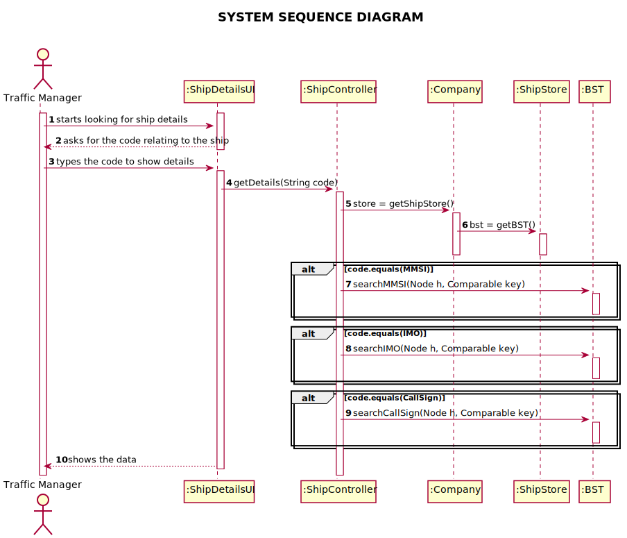

# US 102 - Getting Ship Details

## 1. Requirements Engineering

### 1.1. User Story Description

*As a traffic manager I which to search the details of a ship using any of its codes:
MMSI, IMO or Call Sign.*

### 1.2. Acceptance Criteria

* AC1-correct use of OOP concepts

### 1.3. Found out Dependencies

*No Dependencies were found*

### 1.4 Input and Output Data

*Input Data
* Typed data: Code, date and time
  Output Data
* Information for the ship required

### 1.5. System Sequence Diagram (SSD)

*Insert here a SSD depicting the envisioned Actor-System interactions and throughout which data is inputted and outputted to fulfill the requirement. All interactions must be numbered.*

## 2. Design - User Story Realization

## 2.1. Sequence Diagram (SD)

*In this section, it is suggested to present an UML dynamic view stating the sequence of domain related software objects' interactions that allows to fulfill the requirement.*

## 2.2. Class Diagram (CD)

*In this section, it is suggested to present an UML static view representing the main domain related software classes that are involved in fulfilling the requirement as well as and their relations, attributes and methods.*

# 3. Tests
*In this section, it is suggested to systematize how the tests were designed to allow a correct measurement of requirements fulfilling.*

**Test 1:** Check for ships in the system and not in the system.

	@Test
    void testGetDetails() {
        ShipController controller = new ShipController();
        controller.importShips("files/testShip.csv");
        assertNull((new ShipController()).getDetails("42"));
        assertNull((new ShipController()).getDetails("424242"));
        assertNull((new ShipController()).getDetails("42"));
        assertNull((new ShipController()).getDetails("424242"));
        assertNotNull((new ShipController()).getDetails("211331640"));
        assertNotNull((new ShipController()).getDetails("IMO9193305"));
        assertNotNull((new ShipController()).getDetails("DHBN"));
    }

# 4. Construction (Implementation)

   ##GetDetails method in controller.

    public String getDetails(String code){
    if (Pattern.matches(".*[a-zA-Z]+.*", code) == false) {
    if (code.length() == 9) {
    int MMSI = Integer.parseInt(code);
    return ((Ship) bstMMSI.search(MMSI)).getDetails();
    }
    }
    else {
    if (code.length() == 10) {
    String IMO = code;
    return ((Ship) bstIMO.search(IMO)).getDetails();
    } else {
    String callSign = code;
    return ((Ship) bstCallSign.search(callSign)).getDetails();
    }
    }
    return null;
    }

