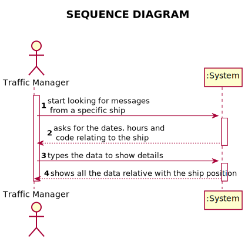
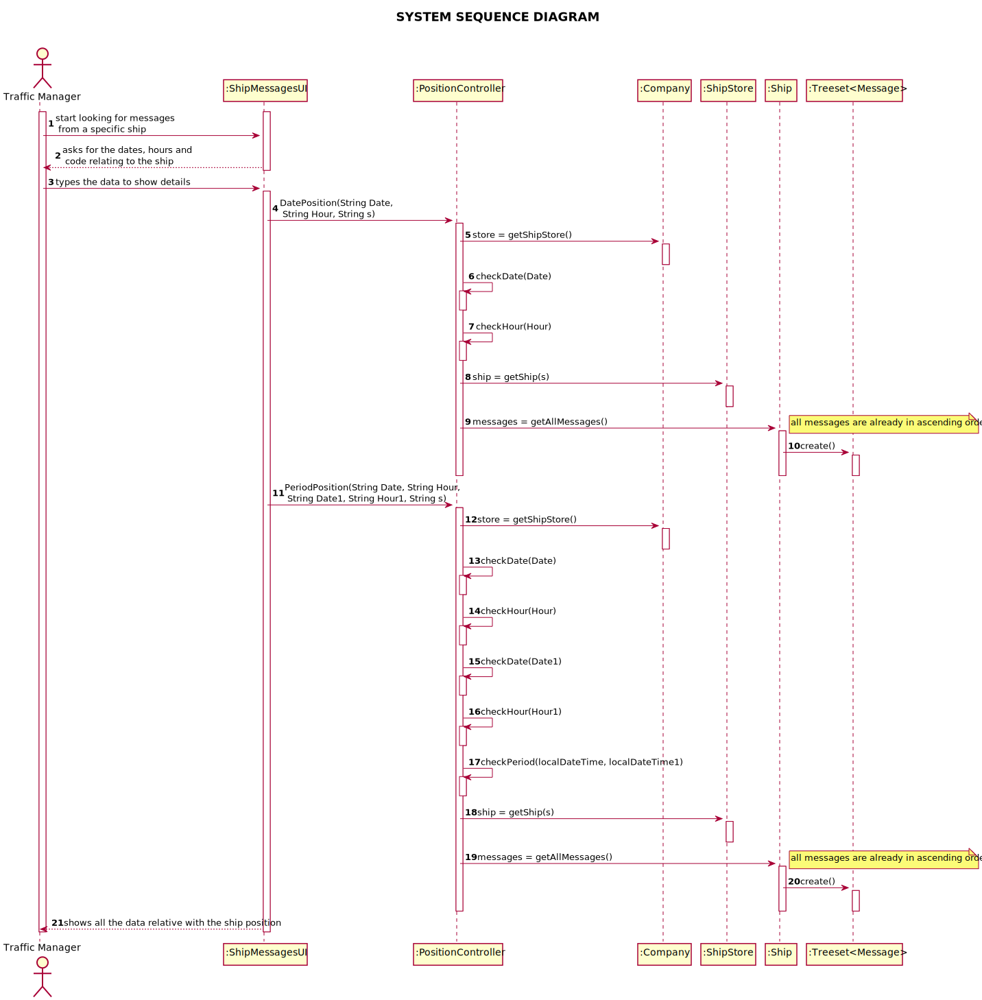
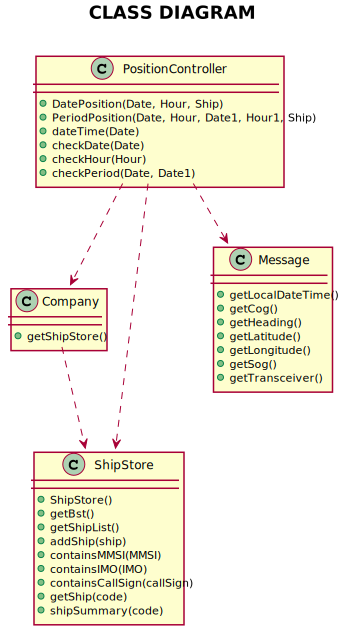

# US103 - Positional messages temporally organized and associated with each of the ships

## 1. Requirements Engineering

### 1.1. User Story Description

* As a traffic manager I which to have the positional messages temporally organized and associated with each of the ships

### 1.2. Acceptance Criteria

* AC1 - Efficient access of any position value(s) of a ship on a period or date

### 1.3. Found out Dependencies

*No Dependencies were found*

### 1.4 Input and Output Data

* Input Data 
  * Typed data: Date, Time and Ship Code
* Output Data 
  * Information of the ship position

### 1.5. System Sequence Diagram (SSD)

*Insert here a SSD depicting the envisioned Actor-System interactions and throughout which data is inputted and outputted to fulfill the requirement. All interactions must be numbered.*

## 2. Design - User Story Realization

## 2.1. Sequence Diagram (SD)

*In this section, it is suggested to present an UML dynamic view stating the sequence of domain related software objects' interactions that allows to fulfill the requirement.*

## 2.2. Class Diagram (CD)

*In this section, it is suggested to present an UML static view representing the main domain related software classes that are involved in fulfilling the requirement as well as and their relations, attributes and methods.*

# 3. Tests
*In this section, it is suggested to systematize how the tests were designed to allow a correct measurement of requirements fulfilling.*

**Test 1:** Check the position of a ship in a period of time

	@Test
    public void testPeriodPosition1() {
        String Date = "31/12/2020";
        String Hour = "16:15";
        String Date1 = "31/12/2020";
        String Hour1 = "18:03";

        DateTimeFormatter formatter = DateTimeFormatter.ofPattern("dd/MM/yyyy HH:mm");
        LocalDateTime dt = LocalDateTime.parse(Date + " " + Hour, formatter);
        LocalDateTime localDateTime = positionController.dateTime(Date + " " + Hour);
        assertEquals(dt, localDateTime);

        LocalDateTime dtr = LocalDateTime.parse(Date1 + " " + Hour1, formatter);
        LocalDateTime localDateTime1 = positionController.dateTime(Date1 + " " + Hour1);
        assertEquals(dtr, localDateTime1);
    }

# 4. Construction (Implementation)

   ##DatePosition method in controller

    /**
     * @param Date - Date in format dd/mm/yyyy
     * @param Hour - Hour in format HH:mm
     * @param s - MMSI/IMO/Call Sigh of the ship
     * @return - List where the positions of the ship are stored according to the input entered
     */
    public List<String> DatePosition(String Date, String Hour, String s) {

        checkDate(Date);
        checkHour(Hour);

        LocalDateTime localDateTime = dateTime(Date + " " + Hour);

        Ship ship = shipStore.getShip(s);
        if (ship == null) {
            throw new IllegalArgumentException("This ship does not exist. :((");
        }
        TreeSet<Message> messages = ship.getAllMessages();
        List<String> list = new ArrayList<>();
        for (Message objects1 : messages) {
            if (localDateTime.equals(objects1.getLocalDateTime())) {
                list.add(String.format("%-20s %-20s %-20s %-20s %-20s",
                        ship.getName(), Date, Hour, objects1.getLatitude(), objects1.getLongitude()));
            }
        }

        return list;
    }

