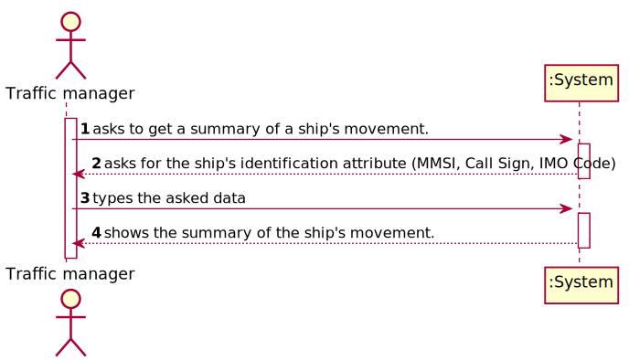
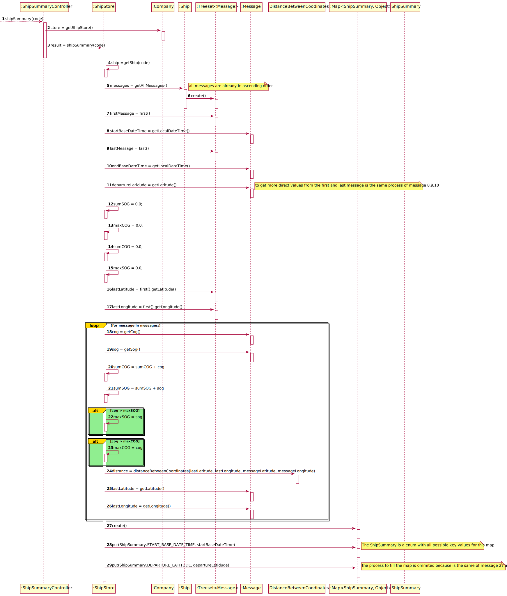
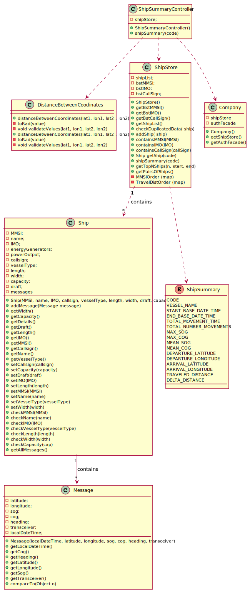

# US 104 - Make a Summary of a ship's movements

## 1. Requirements Engineering

### 1.1. User Story Description

*As a traffic manager I which to make a Summary of a ship's movements.*

### 1.2. Customer Specifications and Clarifications

* From the client clarifications:
* > Question: What should we consider as a ship movement, in order to show the total number of movements in the summary. Can we count as a different movement every time the latitude or longitude of the ship changes, or do we have to have in account any other ship attribute?
* > Answer: A chave de movimento é BaseDateTime

* > Question: According to the provided document in the US104, you would like a summary of a ship's movements but how should we find that specific ship, should we adopt the same approach used in US102 where we find a ship using the MMSI, IMO, callSign, or would you like for us to follow another approach. If so which one?
* > Answer: Yes, adopt the same approach used in US102

### 1.3. System Sequence Diagram (SSD)

*Insert here a SSD depicting the envisioned Actor-System interactions and throughout which data is inputted and outputted to fulfill the requirement. All interactions must be numbered.*

## 3. Design - User Story Realization

## 3.1. Sequence Diagram (SD)

*In this section, it is suggested to present an UML dynamic view stating the sequence of domain related software objects' interactions that allows to fulfill the requirement.*

## 3.2. Class Diagram (CD)

*In this section, it is suggested to present an UML static view representing the main domain related software classes that are involved in fulfilling the requirement as well as and their relations, attributes and methods.*

# 4. Tests

**Test 1:** Checks that the values calculated using the test file are equals to the ones calculated manually.

     @Test
    public void shipSummary() {
        ShipController shipController = new ShipController();
        shipController.importShips("files/testShip.csv");
        ShipSummaryController shipSummaryController = new ShipSummaryController();
        Map<ShipSummary, Object> summary = shipSummaryController.shipSummary("211331640");
        //as distancias estão certas

        DateTimeFormatter formatter = DateTimeFormatter.ofPattern("dd/MM/yyyy HH:mm");
        LocalDateTime START_BASE_DATE_TIME = LocalDateTime.parse("31/12/2020 00:39", formatter);
        LocalDateTime END_BASE_DATE_TIME = LocalDateTime.parse("31/12/2020 18:03", formatter);
        Duration d = Duration.parse( "PT17H24M" );
        Map<ShipSummary, Object> shipSummaryObjectMap = new HashMap<>();
        shipSummaryObjectMap.put(ShipSummary.CODE, "211331640");
        shipSummaryObjectMap.put(ShipSummary.VESSEL_NAME, "SEOUL EXPRESS");
        shipSummaryObjectMap.put(ShipSummary.START_BASE_DATE_TIME, START_BASE_DATE_TIME);
        shipSummaryObjectMap.put(ShipSummary.END_BASE_DATE_TIME, END_BASE_DATE_TIME);
        shipSummaryObjectMap.put(ShipSummary.TOTAL_NUMBER_MOVEMENTS, Integer.parseInt("4"));
        shipSummaryObjectMap.put(ShipSummary.TOTAL_MOVEMENT_TIME, d);
        shipSummaryObjectMap.put(ShipSummary.MEAN_COG, Double.parseDouble("133.25"));
        shipSummaryObjectMap.put(ShipSummary.MEAN_SOG, Double.parseDouble("14.775"));
        shipSummaryObjectMap.put(ShipSummary.MAX_SOG, Double.parseDouble("19.7"));
        shipSummaryObjectMap.put(ShipSummary.MAX_COG, Double.parseDouble("147.6"));

        shipSummaryObjectMap.put(ShipSummary.DEPARTURE_LATITUDE, 36.59348);
        shipSummaryObjectMap.put(ShipSummary.DEPARTURE_LONGITUDE, -122.86674);
        shipSummaryObjectMap.put(ShipSummary.ARRIVAL_LATITUDE, 33.78012);
        shipSummaryObjectMap.put(ShipSummary.ARRIVAL_LONGITUDE, -118.72088);
        shipSummaryObjectMap.put(ShipSummary.DELTA_DISTANCE, 489.61566);

        shipSummaryObjectMap.put(ShipSummary.TRAVELED_DISTANCE, 491.95489000000003);

        for(ShipSummary s : ShipSummary.values()){
            System.out.println(s);
            assertTrue(summary.get(s).equals(shipSummaryObjectMap.get(s) ));
        }

    }

**Test 2:** Test to verify if the code is wrong.

    @Test
    public void shipSummaryWrongCode() {
        ShipController shipController = new ShipController();
        shipController.importShips("files/testShip.csv");
        ShipSummaryController shipSummaryController = new ShipSummaryController();
        Ship ship = App.getInstance().getCompany().getShipStore().getShip("211331640");
        Map<ShipSummary, Object> summary = shipSummaryController.shipSummary("211331640");

        Map<ShipSummary, Object> shipSummaryObjectMap = new HashMap<>();
        shipSummaryObjectMap.put(ShipSummary.CODE, "211331640");

        assertFalse(summary.get(ShipSummary.CODE).equals("211331641") );

    }

**Test 3:** Test the validation of impossible values of coordinates.

    @Test
    public void distanceBetweenCoordinatesImpossibleValues4() {
        double lat1 = 41.176613106509144;
        double lon1 = -19.17886176079889;
        double lat2 = 41.17886176079889;
        double lon2 =  -181.0;
        assertThrows(
                IllegalArgumentException.class,()->{
                    DistanceBetweenCoodinates.distanceBetweenCoordinates(lat1,lon1,lat2,lon2);

                });

    }

**Test 4:** Test with the correct values of coordinates. The calculated distance must be equals to the one calculated manually.

     @Test
    public void distanceBetweenCoordinatesRight() {
        double lat1 = 41.173917974419794;
        double lon1 = -8.549532908229658;
        double lat2 = 41.17885556027196;
        double lon2 =   -8.546897234258287;
        assert DistanceBetweenCoodinates.distanceBetweenCoordinates(lat1,lon1,lat2,lon2) == 0.5917                ;
    }

# 5. Construction (Implementation)

##ShipSummary Method in TestStore

    public Map<ShipSummary, Object> shipSummary(String code){
        Map<ShipSummary, Object> shipSummaryObjectMap = new HashMap<>();

        //put the vessel name in the map
        Ship ship = getShip(code);

        TreeSet<Message> messages = ship.getAllMessages(); //all messages are already in ascending order
        LocalDateTime startBaseDateTime = messages.first().getLocalDateTime();
        LocalDateTime endBaseDateTime = messages.last().getLocalDateTime();
        Duration totalMovementTime = Duration.between(startBaseDateTime, endBaseDateTime);

        //1 Minute = 60 Seconds
        //1 Hour = 3600 Seconds ( 60 * 60 )
        //1 Day = 86400 Second ( 24 * 3600 )
        /*
        int[] time = secondsToDHMS(totalMovementTime.getSeconds());
        Integer totalMovementTimeDays = time[0];
        Integer totalMovementTimeHours = time[1];
        Integer totalMovementTimeMinuts = time[2];
        Integer totalMovementTimeSecs = time[3];*/
        Double departureLatidude = messages.first().getLatitude();
        Double departureLongitude = messages.first().getLongitude();
        Double arrivalLatidude = messages.last().getLatitude();
        Double arrivalLongitude = messages.last().getLongitude();
        Double deltaDistance = DistanceBetweenCoodinates.distanceBetweenCoordinates(departureLatidude, departureLongitude, arrivalLatidude, arrivalLongitude);

        Double sumSOG = 0.0;
        Double maxCOG = 0.9;
        Double sumCOG = 0.9;
        Double maxSOG = 0.0;
        Double lastLatitude = messages.first().getLatitude();
        Double lastLongitude = messages.first().getLongitude();
        Double sumDistances = 0.0;

        // O(N)
        for (Message m : messages) {
            sumCOG = sumCOG + m.getCog();
            sumSOG = sumSOG + m.getSog();

            if (m.getCog() >= maxCOG) {
                maxCOG = m.getCog();
            }
            if (m.getSog() >= maxSOG) {
                maxSOG = m.getSog();
            }
            sumDistances = sumDistances + DistanceBetweenCoodinates.distanceBetweenCoordinates(lastLatitude, lastLongitude, m.getLatitude(), m.getLongitude());
            lastLatitude = m.getLatitude();
            lastLongitude = m.getLongitude();
        }
        DecimalFormat df = new DecimalFormat("#.#####"); //get rounded value
        //df.setRoundingMode(RoundingMode.CEILING);

        // Complexity of .pu() method: O(1)
        shipSummaryObjectMap.put(ShipSummary.CODE, code);
        shipSummaryObjectMap.put(ShipSummary.VESSEL_NAME, ship.getName());
        shipSummaryObjectMap.put(ShipSummary.START_BASE_DATE_TIME, startBaseDateTime);
        shipSummaryObjectMap.put(ShipSummary.END_BASE_DATE_TIME, endBaseDateTime);
        shipSummaryObjectMap.put(ShipSummary.TOTAL_NUMBER_MOVEMENTS, messages.size());
        shipSummaryObjectMap.put(ShipSummary.TOTAL_MOVEMENT_TIME, totalMovementTime);
        shipSummaryObjectMap.put(ShipSummary.MEAN_COG, Double.parseDouble(df.format(sumCOG/messages.size()).replace(",",".")));
        shipSummaryObjectMap.put(ShipSummary.MEAN_SOG, Double.parseDouble(df.format(sumSOG/messages.size()).replace(",",".")));
        shipSummaryObjectMap.put(ShipSummary.MAX_SOG, Double.parseDouble(df.format(maxSOG).replace(",",".")));
        shipSummaryObjectMap.put(ShipSummary.MAX_COG, Double.parseDouble(df.format(maxCOG).replace(",",".")));

        shipSummaryObjectMap.put(ShipSummary.DEPARTURE_LATITUDE, departureLatidude);
        shipSummaryObjectMap.put(ShipSummary.DEPARTURE_LONGITUDE, departureLongitude);
        shipSummaryObjectMap.put(ShipSummary.ARRIVAL_LATITUDE, arrivalLatidude);
        shipSummaryObjectMap.put(ShipSummary.ARRIVAL_LONGITUDE, arrivalLongitude);
        shipSummaryObjectMap.put(ShipSummary.DELTA_DISTANCE, deltaDistance);

        shipSummaryObjectMap.put(ShipSummary.TRAVELED_DISTANCE, sumDistances);
        return shipSummaryObjectMap;

    }

##DistanceBetweenCoordinates

    public static double distanceBetweenCoordinates(double lat1, double lon1, double lat2 , double lon2) {
        validateValues(lat1,lon1,lat2,lon2);
        final double R = 6371.0088; // Radious of the earth

        double latDistance = toRad(lat2-lat1);
        double lonDistance = toRad(lon2-lon1);
        double a = Math.sin(latDistance / 2) * Math.sin(latDistance / 2) + Math.cos(toRad(lat1)) * Math.cos(toRad(lat2)) *
                Math.sin(lonDistance / 2) * Math.sin(lonDistance / 2);
        double c = 2 * Math.atan2(Math.sqrt(a), Math.sqrt(1-a));

        DecimalFormat df = new DecimalFormat("#.#####"); //get rounded value
        df.setRoundingMode(RoundingMode.CEILING);

        return Double.parseDouble(df.format(R * c).replace(",","."));

    }

    /**
     * This method converts a value from degrees to radian.
     * @param value degree value
     * @return radian value
     */
    private static Double toRad(Double value) {
        return value * Math.PI / 180;
    }

    /**
     * Validates the values of the coordinates.
     * @param lat1 latitude 1
     * @param lon1 longitude 1
     * @param lat2 latitude 2
     * @param lon2 longitude 2
     */
    private static void validateValues(double lat1, double lon1, double lat2, double lon2){
        //https://stackoverflow.com/questions/15965166/what-are-the-lengths-of-location-coordinates-latitude-and-longitude
        if(lat1 < -90 || lat1 > 90||lat2< -90 || lat2 > 90) {
            throw new IllegalArgumentException("The latitude cannot be outside of the range -90 - +90");
        }
        if(lon1 < -180 || lon1 > 180||lon2< -180 || lon2 > 180) {
            throw new IllegalArgumentException("The longitude cannot be outside of the range -180 - +180");
        }

    }
}

