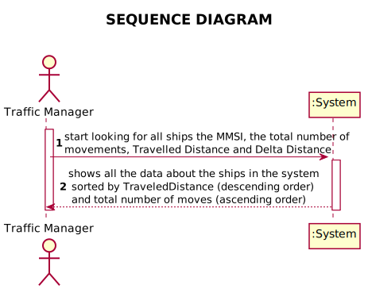
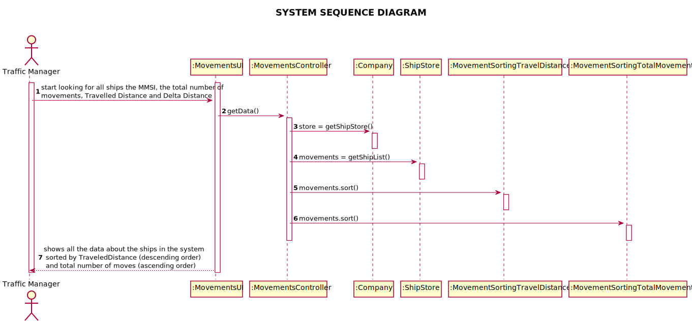
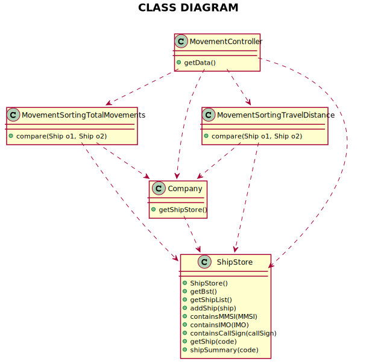

# US105 List for all ships the MMSI, the total number of movements, Travelled Distance and Delta Distance

## 1. Requirements Engineering

### 1.1. User Story Description

* As a traffic manager I which to list for all ships the MMSI, the total number of movements, Travelled Distance and Delta Distance

### 1.2. Acceptance Criteria

* AC1 - ordered by Travelled Distance and total number of movements (descending/ascending)

### 1.3. Found out Dependencies

*No Dependencies were found*

### 1.4 Input and Output Data

* Input Data 
  * Nothing
* Output Data 
  * Information of all the ships

### 1.5. System Sequence Diagram (SSD)

*Insert here a SSD depicting the envisioned Actor-System interactions and throughout which data is inputted and outputted to fulfill the requirement. All interactions must be numbered.*

## 2. Design - User Story Realization

## 2.1. Sequence Diagram (SD)

*In this section, it is suggested to present an UML dynamic view stating the sequence of domain related software objects' interactions that allows to fulfill the requirement.*

## 2.2. Class Diagram (CD)

*In this section, it is suggested to present an UML static view representing the main domain related software classes that are involved in fulfilling the requirement as well as and their relations, attributes and methods.*

# 3. Tests
*In this section, it is suggested to systematize how the tests were designed to allow a correct measurement of requirements fulfilling.*

**Test 1:** Check for if the Travel Distance of all the ships is in descending order

	@Test
    public void checkDescendingOrderTravelledDistanceCorrect() {
        System.out.println("Check if the List is in Descending Order per Travelled Distance");
        LinkedHashMap<Ship, List<String>> hashMap = movementsController.getData();

        ArrayList<Double> Codes = new ArrayList<>();
        Double Cod1 = 3558.13752;
        Double Cod2 = 2657.35103;
        Double Cod3 = 26.36737;
        Codes.add(Cod1);
        Codes.add(Cod2);
        Codes.add(Cod3);
        int i = 0;

        for (Map.Entry<Ship, List<String>>  m : hashMap.entrySet()) {
            Ship ship = m.getKey();
            assert Codes.get(i).equals(shipStore.shipSummary(String.valueOf(ship.getMMSI())).get(ShipSummary.TRAVELED_DISTANCE));
            i++;
        }
    }

# 4. Construction (Implementation)

   ##Getdata method in controller

     /**
     * Method that sorts lists for all ships the MMSI, the total number of movements, Travelled Distance and Delta Distance.
     * Acceptance criteria [ESINF]: ordered by Travelled Distance and total number of movements (descending/ascending).
     * @return LinkedHashMap with all information sorted
     */
    public LinkedHashMap<Ship, List<String>> getData() {

        ArrayList<Ship> movements = new ArrayList<>(shipList);
        movements.sort(new MovementSortingTravelDistance());
        ArrayList<Ship> Temporary = new ArrayList<>();
        ArrayList<Ship> Final = new ArrayList<>();

        for (int i = 0; i < movements.size() - 1; i++) {
            if (shipStore.shipSummary(String.valueOf(movements.get(i).getMMSI())).get(ShipSummary.TRAVELED_DISTANCE).equals(shipStore.shipSummary(String.valueOf(movements.get(i + 1).getMMSI())).get(ShipSummary.TRAVELED_DISTANCE))) {
                Temporary.add(movements.get(i));
                if(i+1 == movements.size()-1){
                    Temporary.add(movements.get(i+1));
                }

            } else if (Temporary.size() == 0) {
                Final.add(movements.get(i));

            }
        }
        Temporary.sort(new MovementSortingTotalMovements());
        Final.addAll(Temporary);

        LinkedHashMap<Ship, List<String>> hashMap = new LinkedHashMap<Ship, List<String>>();
        for (Ship ship : Final){
            List<String> informations = new ArrayList<>();
            informations.add(String.valueOf(ship.getMMSI()));
            informations.add(String.valueOf(shipStore.shipSummary(String.valueOf(ship.getMMSI())).get(ShipSummary.TOTAL_NUMBER_MOVEMENTS)));
            informations.add(String.valueOf(shipStore.shipSummary(String.valueOf(ship.getMMSI())).get(ShipSummary.TRAVELED_DISTANCE)));
            informations.add(String.valueOf(shipStore.shipSummary(String.valueOf(ship.getMMSI())).get(ShipSummary.DELTA_DISTANCE)));
            hashMap.put(ship, informations);
        }
        return hashMap;
    }

