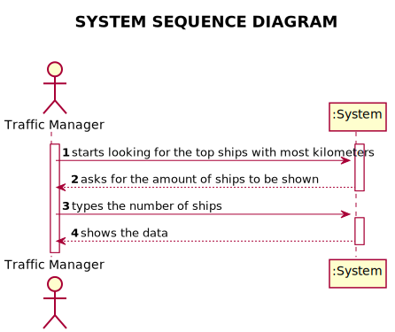
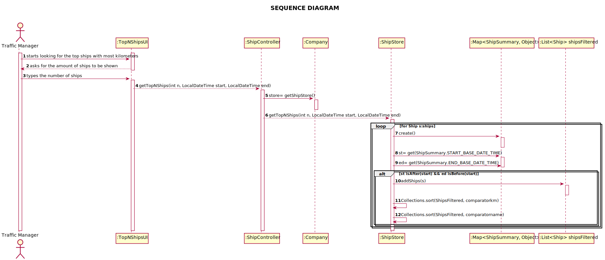
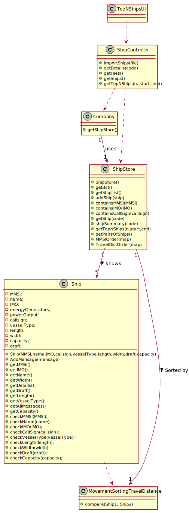

# US 106 - Get the top-N ships

## 1. Requirements Engineering

### 1.1. User Story Description

*Get the top-N ships with the most kilometres travelled and their average speed(MeanSOG).*

### 1.2. Customer Specifications and Clarifications

* From the client clarifications:
* > Question: Regarding both US106 and US107 should we assume that these functionalities will be used by the Traffic Manager or is it for another role in the company? This detail is not present, unlike in the other User Stories.
* > Answer: Yes, you can assume a Traffic Manager will be performing those tasks.

* > Question: Imagine if you have a ship with positions between day 22 and 29. You want topN ships since day 20 to 23. As you can see, not all positions are in the period. Should we consider that ship to topN and not?
* > Answer: Sim, deve considerar as mensagens que estão no período.

* > Question: The US106 says "Get the top-N ships with the most kilometres travelled and their average speed (MeanSOG).". When you use this functionality, what attributes of the ship would you like to see next to the ranked by kilometres travelled ships? 
* > Answer: MMSI, VesselType, kilometres travelled, MeanSOG

* > Question: The US106 ("Get the top-N ships with the most kilometres travelled and their average speed (MeanSOG)")  has an acceptance criteria that consists of  "group by VesselType". But I have a doubt. It is asked to get the top-N ships with the most km, and then group them by Vessel Type? Or for each Vessel Type get the top-N ships with the most km travelled?
* > Answer: for each Vessel Type get the top-N ships with the most km travelled

### 1.3. System Sequence Diagram (SSD)

*Insert here a SSD depicting the envisioned Actor-System interactions and throughout which data is inputted and outputted to fulfill the requirement. All interactions must be numbered.*

## 3. Design - User Story Realization

## 3.1. Sequence Diagram (SD)

*In this section, it is suggested to present an UML dynamic view stating the sequence of domain related software objects' interactions that allows to fulfill the requirement.*

## 3.2. Class Diagram (CD)

*In this section, it is suggested to present an UML static view representing the main domain related software classes that are involved in fulfilling the requirement as well as and their relations, attributes and methods.*

# 4. Tests

**Test 1:** Checks if getTopNShips Method is working correctly

    @Test
    void testGetTopNShips() {
        ShipController shipController = new ShipController();
        LocalDateTime start = LocalDateTime.of(1, 1, 1, 1, 1);
        assertTrue(shipController.getTopNShips(1, start, LocalDateTime.of(1, 1, 1, 1, 1)).isEmpty());
    }

# 5. Construction (Implementation)

**getTopNShips** Method in ShipStore

    public LinkedHashMap<String, List<Ship>> getTopNShips(int n, LocalDateTime start, LocalDateTime end) {
        LinkedHashMap<String, List<Ship>> linkedHashMap = new LinkedHashMap<>();

        List<Ship> shipsFiltered = new ArrayList<>();
        String lastVesselType = "";
        //make the list of vessel types
        List<String> vesselTypeList = new ArrayList<>();
        for (Ship s: shipList){
            Map<ShipSummary, Object> map1 = shipSummary(String.valueOf(s.getMMSI()));
            if (!s.getVesselType().equals(lastVesselType) && ((((LocalDateTime)map1.get(ShipSummary.START_BASE_DATE_TIME)).isAfter(start) || ((LocalDateTime)map1.get(ShipSummary.START_BASE_DATE_TIME)).isEqual(start))
                    && (((LocalDateTime)map1.get(ShipSummary.END_BASE_DATE_TIME)).isBefore(end) || ((LocalDateTime)map1.get(ShipSummary.END_BASE_DATE_TIME)).isEqual(end)))){
                vesselTypeList.add(s.getVesselType());
            }
            lastVesselType = s.getVesselType();
        }

        //Linked hashmap with vesselType as key and a list of ships for each vesselType, with the same vesselType and between the dates
        LinkedHashMap<String, List<Ship>> vesselTypeMap = new LinkedHashMap<>();
        for (String vessel: vesselTypeList){
            List<Ship> shipp = new ArrayList<>();
            for (Ship ship: shipList){
                if (ship.getVesselType().equals(vessel)){
                    shipp.add(ship);
                }
            }
            vesselTypeMap.put(vessel, shipp);
        }

        for (String vesselType: vesselTypeList){

            shipsFiltered = vesselTypeMap.get(vesselType);

            shipsFiltered.sort(new MovementSortingTravelDistance());
            List<Ship> subItems = new ArrayList<>();
            int nCopy = n;
            if (shipsFiltered.size()<nCopy){
                while (shipsFiltered.size()!=nCopy){
                    nCopy--;
                }
                subItems = new ArrayList<Ship>(shipsFiltered.subList(0, nCopy));
            }else{
                subItems = new ArrayList<Ship>(shipsFiltered.subList(0, nCopy));
            }
            linkedHashMap.put(vesselType, subItems);

        }
        return linkedHashMap;
    }

**MMSIOrder** Method in ShipStore

    private LinkedHashMap<Ship, HashMap<Double, Ship>> MMSIOrder (HashMap<Ship, HashMap<Double, Ship>> map){

        List<Ship> ships1 = new ArrayList<>(map.keySet());
        ships1.sort(new MMSISorter());

        LinkedHashMap<Ship, HashMap<Double, Ship>> sortedMap = new LinkedHashMap<>();
        for (Ship d: ships1){
            sortedMap.put(d, map.get(d));
        }

        return sortedMap;
    }