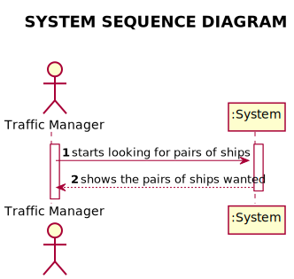
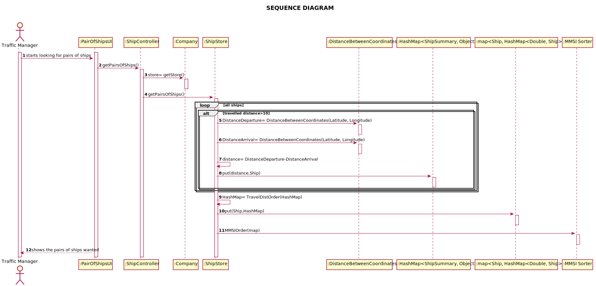
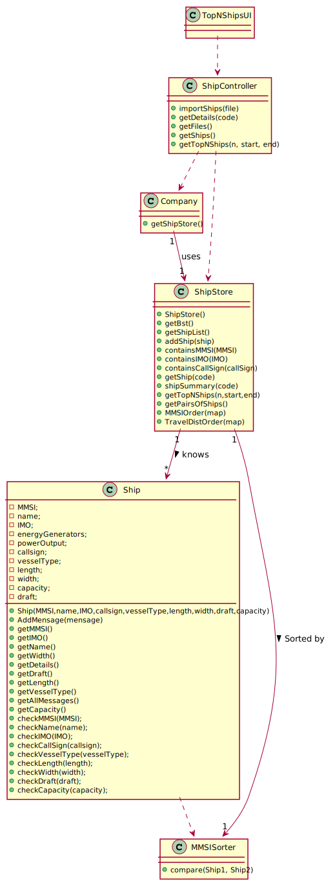

# US 107 - Pairs of Ships

## 1. Requirements Engineering

### 1.1. User Story Description

*Return pairs of ships with routes with close departure/arrival coordinates (no
more than 5 Kms away) and with different Travelled Distance.*

### 1.2. Acceptance Criteria

* AC1-Sorted by the MMSI code of the 1st ship and in descending order of the
  Travelled Distance difference.
* AC2-Do not consider ships with Travelled Distance less than 10 kms.

### 1.3. Found out Dependencies

*No Dependencies were found*

### 1.4 Input and Output Data

Input Data

  Output Data
* All pairs of ships wanted with their MMSI and 

### 1.5. System Sequence Diagram (SSD)

*Insert here a SSD depicting the envisioned Actor-System interactions and throughout which data is inputted and outputted to fulfill the requirement. All interactions must be numbered.*

## 2. Design - User Story Realization

## 2.1. Sequence Diagram (SD)

*In this section, it is suggested to present an UML dynamic view stating the sequence of domain related software objects' interactions that allows to fulfill the requirement.*

## 2.2. Class Diagram (CD)

*In this section, it is suggested to present an UML static view representing the main domain related software classes that are involved in fulfilling the requirement as well as and their relations, attributes and methods.*

# 3. Tests
*In this section, it is suggested to systematize how the tests were designed to allow a correct measurement of requirements fulfilling.*

**Test 1:** Check for Pairs of Ships

	@Test
    public void testGetPairsOfShips(){
        App.getInstance().getCompany().getShipStore().clearShipList();
        ShipController shipController = new ShipController();
        shipController.importShips("files/sships.csv");
        AbstractMap<Ship, HashMap<Double, Ship>> actual = new LinkedHashMap<>();
        LinkedHashMap<Ship, HashMap<Double, Ship>> expected = new LinkedHashMap<>();

        LinkedHashMap<Double, Ship> linkedHashMap1 = new LinkedHashMap();
        linkedHashMap1.put(4.324050000000057, App.getInstance().getCompany().getShipStore().getShip("305373000"));
        expected.put(App.getInstance().getCompany().getShipStore().getShip("228339600"), linkedHashMap1);

        LinkedHashMap<Double, Ship> linkedHashMap2 = new LinkedHashMap();
        linkedHashMap2.put(1.6823199999998906, App.getInstance().getCompany().getShipStore().getShip("636019825"));
        expected.put(App.getInstance().getCompany().getShipStore().getShip("256888000"), linkedHashMap2);

        LinkedHashMap<Double, Ship> linkedHashMap3 = new LinkedHashMap();
        linkedHashMap3.put(4.606329999999957, App.getInstance().getCompany().getShipStore().getShip("258692000"));
        expected.put(App.getInstance().getCompany().getShipStore().getShip("257881000"), linkedHashMap3);

        actual = App.getInstance().getCompany().getShipStore().getPairsOfShips();
        assertTrue(expected.equals(actual));
    }
# 4. Construction (Implementation)

## getPairsOfShips method in ShipStore.

    public AbstractMap<Ship, HashMap<Double, Ship>> getPairsOfShips() {
        ShipSummaryController shipSummaryController = new ShipSummaryController();
        HashMap<Ship, HashMap<Double, Ship>> map = new HashMap<>();
        LinkedHashMap<Ship, HashMap<Double, Ship>> mapSorted = new LinkedHashMap<>();
        List<Ship> ships2 = new ArrayList<>();
        HashMap<Double, Ship> shipHashMap = new HashMap<>();
        for (Ship ship1 : shipList) {
            //System.out.println("\nShip 1: " + ship1.getName());
            ships2 = new ArrayList<>();
            shipHashMap = new HashMap<>();
            for (Ship ship2 : shipList) {
                //System.out.println("Ship 2: " + ship2.getName());
                if (ship1 != ship2 && !map.containsKey(ship2) && !map.containsValue(ship2)) {
                    Map<ShipSummary, Object> map1 = shipSummaryController.shipSummary(String.valueOf(ship1.getMMSI()));
                    Map<ShipSummary, Object> map2 = shipSummaryController.shipSummary(String.valueOf(ship2.getMMSI()));
                    if ((Double) map1.get(ShipSummary.TRAVELED_DISTANCE) >= 10 && (Double) map2.get(ShipSummary.TRAVELED_DISTANCE) >= 10) {
                        Double distanceDeparture = DistanceBetweenCoodinates.distanceBetweenCoordinates((Double) map1.get(ShipSummary.DEPARTURE_LATITUDE), (Double) map1.get(ShipSummary.DEPARTURE_LONGITUDE), (Double) map2.get(ShipSummary.DEPARTURE_LATITUDE), (Double) map2.get(ShipSummary.DEPARTURE_LONGITUDE));
                        Double distanceArrival = DistanceBetweenCoodinates.distanceBetweenCoordinates((Double) map1.get(ShipSummary.ARRIVAL_LATITUDE), (Double) map1.get(ShipSummary.ARRIVAL_LONGITUDE), (Double) map2.get(ShipSummary.ARRIVAL_LATITUDE), (Double) map2.get(ShipSummary.ARRIVAL_LONGITUDE));
                        //System.out.println(distanceDeparture);
                        //System.out.println(distanceArrival);
                        //System.out.println(Math.abs(distanceDeparture - distanceArrival));
                        if (Math.abs(distanceDeparture - distanceArrival) <= 5) {
                            //System.out.println(distanceDeparture);
                            //System.out.println(distanceArrival);

                            //map.put(ship1, ship2);
                            double diference = Math.abs(distanceDeparture - distanceArrival);
                            shipHashMap.put(diference, ship2);
                        }
                    }
                }

            }
            shipHashMap = TravelDistOrder(shipHashMap);
            map.put(ship1, shipHashMap);
        }

        map = MMSIOrder(map);
        List<Ship> ships1 = new ArrayList<>(map.keySet());
        ships1.sort(new MMSISorter());
        for (Ship s1: ships1){
            if (map.get(s1).size()>0){
                mapSorted.put(s1, map.get(s1));
            }
        }
        return mapSorted;
    }

## MMSIOrder method in ShipStore.
      private LinkedHashMap<Ship, HashMap<Double, Ship>> MMSIOrder (HashMap<Ship, HashMap<Double, Ship>> map){

        List<Ship> ships1 = new ArrayList<>(map.keySet());
        ships1.sort(new MMSISorter());

        LinkedHashMap<Ship, HashMap<Double, Ship>> sortedMap = new LinkedHashMap<>();
        for (Ship d: ships1){
            sortedMap.put(d, map.get(d));
        }

        return sortedMap;
    }
## TravelDistOrder method in ShipStore.
    /**
     * This method orders the ships by travelled distance
     * @param map
     * @return LinkedHashMap with travelled distance and a ship
     */
    private LinkedHashMap<Double, Ship> TravelDistOrder (HashMap<Double, Ship> map){

        List<Double> doubles = new ArrayList<>(map.keySet());

        Collections.sort(doubles);

        LinkedHashMap<Double, Ship> st = new LinkedHashMap<>();
        int index = 0;
        for (Double d: doubles){
            Ship ship = map.get(d);
            st.put(d, ship);
            index++;
        }

        return st;
    }

