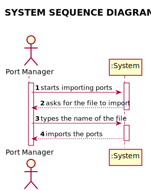
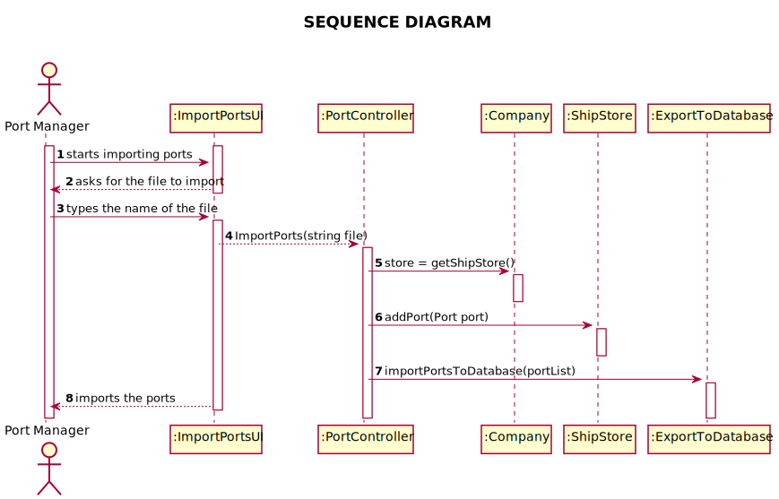
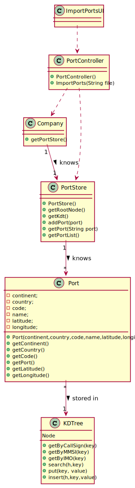

# US 201 - Import ports from a text file and create a 2D-tree

## 1. Requirements Engineering

### 1.1. User Story Description

*As a Port manager, I which to import ports from a text file and create a 2D-tree
with port locations*

### 1.2. System Sequence Diagram (SSD)

*Insert here a SSD depicting the envisioned Actor-System interactions and throughout which data is inputted and outputted to fulfill the requirement. All interactions must be numbered.*

## 2. Design - User Story Realization

## 2.1. Sequence Diagram (SD)

*In this section, it is suggested to present an UML dynamic view stating the sequence of domain related software objects' interactions that allows to fulfill the requirement.*

## 2.2. Class Diagram (CD)

*In this section, it is suggested to present an UML static view representing the main domain related software classes that are involved in fulfilling the requirement as well as and their relations, attributes and methods.*

# 3. Tests

**Test 1:** Checks if the insert in tree is in a balanced way

      @Test
    void testInsertInTree14() {
        KDTree kdTree = new KDTree();

        ArrayList<KDNode> kdNodeList = new ArrayList<>();
        kdNodeList.add(new KDNode(new double[]{10.0, 10.0, 10.0, 10.0, 10.0, 10.0, 10.0, 10.0}, "Obj"));
        kdNodeList.add(new KDNode(new double[]{2.0, 10.0, 10.0, 10.0, 10.0, 10.0, 10.0, 10.0}, "Obj"));
        kdTree.insertInTree(kdNodeList, 1);
        assertEquals(2, kdNodeList.size());
        assertFalse(kdTree.isEmpty());
        KDNode root = kdTree.getRoot();
        assertEquals(10.0, root.getLong());
        assertEquals(2.0, root.getLat());
        assertEquals(2, root.getData().length);
        Object expectedObject = kdNodeList.get(1).getObject();
        assertSame(expectedObject, root.getObject());
        assertNull(root.left);
        KDNode kdNode = root.right;
        assertNull(kdNode.left);
        Object expectedObject1 = kdNodeList.get(0).getObject();
        assertSame(expectedObject1, kdNode.getObject());
        assertEquals(10.0, kdNode.getLong());
        assertEquals(10.0, kdNode.getLat());
        assertEquals(2, kdNode.getData().length);
        assertNull(kdNode.right);
    }

        
}