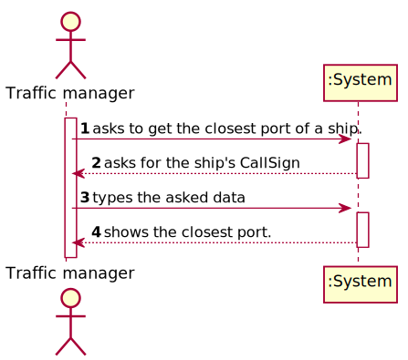
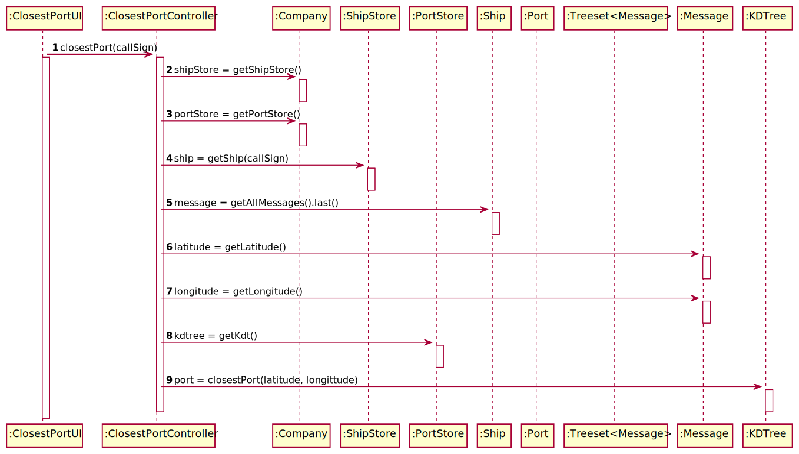
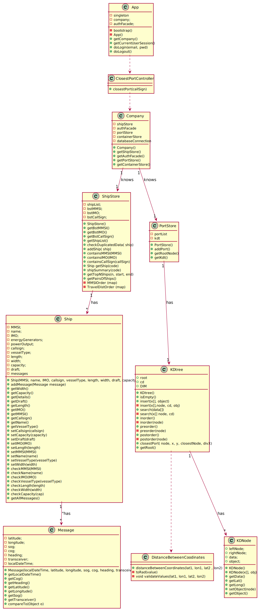

# US 202 - Get the closest port of a ship in a certain datetime

## 1. Requirements Engineering

### 1.1. User Story Description

*As a Traffic manager, I which to find the closest port of a ship given its CallSign,
on a certain DateTime.*

### 1.2. System Sequence Diagram (SSD)

*Insert here a SSD depicting the envisioned Actor-System interactions and throughout which data is inputted and outputted to fulfill the requirement. All interactions must be numbered.*

## 3. Design - User Story Realization

## 3.1. Sequence Diagram (SD)

*In this section, it is suggested to present an UML dynamic view stating the sequence of domain related software objects' interactions that allows to fulfill the requirement.*

## 3.2. Class Diagram (CD)

*In this section, it is suggested to present an UML static view representing the main domain related software classes that are involved in fulfilling the requirement as well as and their relations, attributes and methods.*

# 4. Tests

**Test 1:** Checks that the value returned cannot be null

      @Test
    void closestPortNotNull(){
        String date = "31/12/2020 18:31";
        DateTimeFormatter ft = DateTimeFormatter.ofPattern("dd/MM/yyyy HH:mm");
        LocalDateTime date1 = LocalDateTime.parse(date, ft);
        Port p = closestPortController.closestPort("C4SQ2",date1);
        assertNotNull(p);
    }
}

