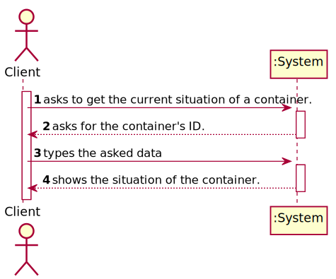
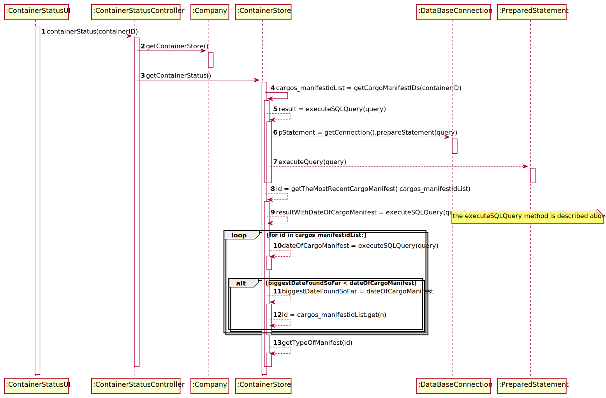
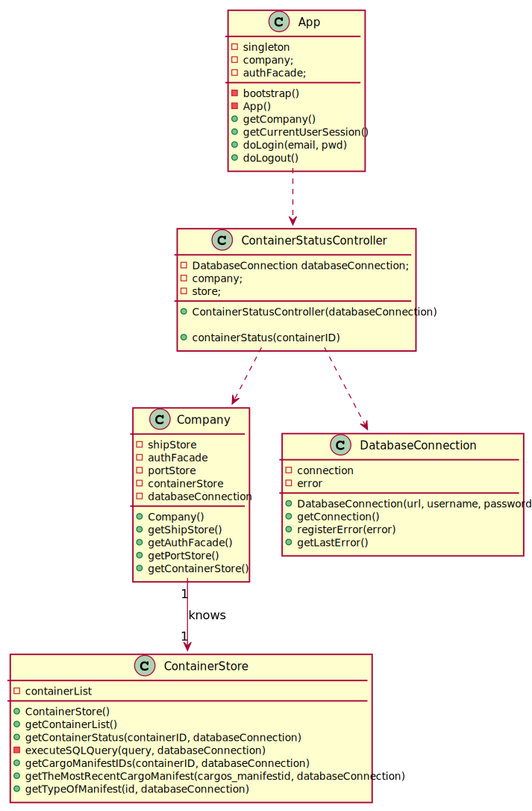

# US 202 - Get the situation of a container

## 1. Requirements Engineering

### 1.1. User Story Description

*As Client, I want to know the current situation of a specific container being used
to transport my goods.*

### 1.2. System Sequence Diagram (SSD)

*Insert here a SSD depicting the envisioned Actor-System interactions and throughout which data is inputted and outputted to fulfill the requirement. All interactions must be numbered.*

## 3. Design - User Story Realization

## 3.1. Sequence Diagram (SD)

*In this section, it is suggested to present an UML dynamic view stating the sequence of domain related software objects' interactions that allows to fulfill the requirement.*

## 3.2. Class Diagram (CD)

*In this section, it is suggested to present an UML static view representing the main domain related software classes that are involved in fulfilling the requirement as well as and their relations, attributes and methods.*

# 4. Tests

**Test 1:** Checks if the value returned is the right one.

    @Test
    void containerStatus() throws SQLException {
        ResultSet rs = mock(ResultSet.class);
        ContainerStatusController c = new ContainerStatusController(databaseConnection);
        when(databaseConnection.getConnection()).thenReturn(connection);
        when(databaseConnection.getConnection().prepareStatement(anyString())).thenReturn(s);
        when(rs.next()).thenReturn(true).thenReturn(false);
        when(s.executeQuery(anyString())).thenReturn(rs);
        when(rs.getString(eq("cargo_manifestid"))).thenReturn("123456");
        when(rs.getString(eq("BASE_DATE_TIME"))).thenReturn("2020-01-18 18:32");
        when(rs.getString(eq("NAME"))).thenReturn("N.R.P. CHEIRO ORGULHOSO");
        when(rs.getString(eq("TYPE"))).thenReturn("TO BE UNLOADED");
        //System.out.println(c.containerStatus("1111"));
        assertTrue("SHIP, N.R.P. CHEIRO ORGULHOSO".equals(c.containerStatus("1111")));

    }
    @Test
    void containerStatusPort() throws SQLException {
        ResultSet rs = mock(ResultSet.class);
        ContainerStatusController c = new ContainerStatusController(databaseConnection);
        when(databaseConnection.getConnection()).thenReturn(connection);
        when(databaseConnection.getConnection().prepareStatement(anyString())).thenReturn(s);
        when(rs.next()).thenReturn(true).thenReturn(false);
        when(s.executeQuery(anyString())).thenReturn(rs);
        when(rs.getString(eq("cargo_manifestid"))).thenReturn("123456");
        when(rs.getString(eq("BASE_DATE_TIME"))).thenReturn("2020-01-18 18:32");
        when(rs.getString(eq("NAME"))).thenReturn("CHEIRO MARITIMO");
        when(rs.getString(eq("TYPE"))).thenReturn("TO BE OFFLOADED");
        //System.out.println(c.containerStatus("1111"));
            assertTrue("PORT, CHEIRO MARITIMO".equals(c.containerStatus("1111")));
    }

**Test 2:** Checks if the container exists.

    @Test
    void containerStatusNull() throws SQLException {
        ResultSet rs = mock(ResultSet.class);
        ContainerStatusController c = new ContainerStatusController(databaseConnection);
        when(databaseConnection.getConnection()).thenReturn(connection);
        when(databaseConnection.getConnection().prepareStatement(anyString())).thenReturn(s);
        //when(rs.next()).thenReturn(true).thenReturn(false);
        //when(s.executeQuery(anyString())).thenReturn(rs);
        when(rs.getString(eq("cargo_manifestid"))).thenReturn("123456");
        when(rs.getString(eq("BASE_DATE_TIME"))).thenReturn("2020-01-18 18:32");
        when(rs.getString(eq("NAME"))).thenReturn("N.R.P. CHEIRO ORGULHOSO");
        when(rs.getString(eq("TYPE"))).thenReturn("TO BE UNLOADED");
        //System.out.println(c.containerStatus("1111"));
        NullPointerException thrown = assertThrows(
                NullPointerException.class,
                () -> c.containerStatus("1111")
        );
    }
    @Test
    void containerStatusNull2() throws SQLException {
        ResultSet rs = mock(ResultSet.class);
        ContainerStatusController c = new ContainerStatusController(databaseConnection);
        when(databaseConnection.getConnection()).thenReturn(connection);
        when(databaseConnection.getConnection().prepareStatement(anyString())).thenReturn(s);
        when(rs.next()).thenReturn(false);
        when(s.executeQuery(anyString())).thenReturn(rs);
        when(rs.getString(eq("cargo_manifestid"))).thenReturn("123456");
        when(rs.getString(eq("BASE_DATE_TIME"))).thenReturn("2020-01-18 18:32");
        when(rs.getString(eq("NAME"))).thenReturn("N.R.P. CHEIRO ORGULHOSO");
        when(rs.getString(eq("TYPE"))).thenReturn("TO BE UNLOADED");
        //System.out.println(c.containerStatus("1111"));
        SQLException thrown = assertThrows(
                SQLException.class,
                () -> c.containerStatus("1111")
        );
    }
}

