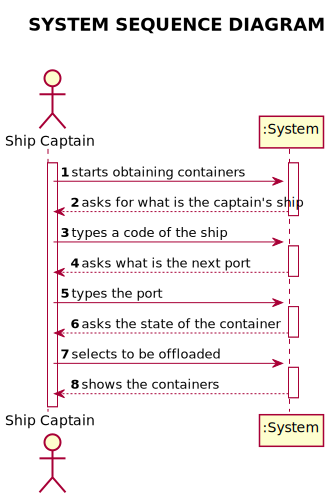
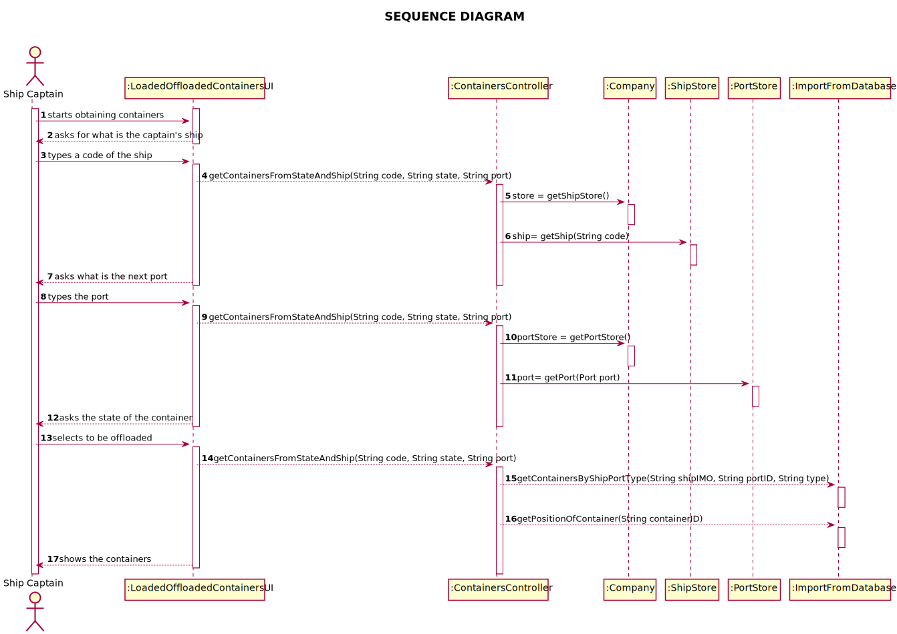
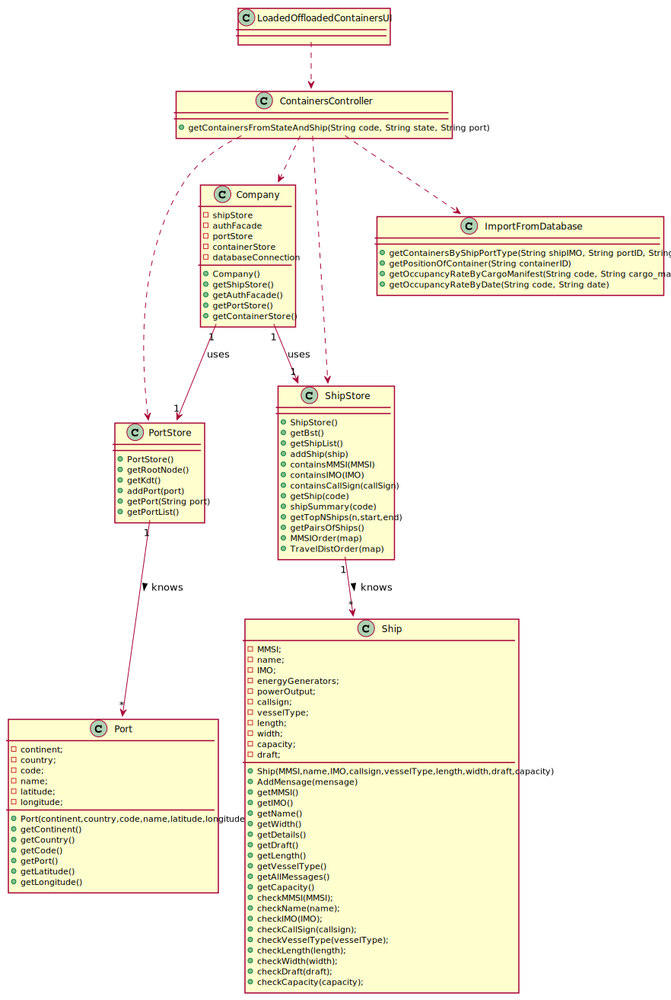

# US 201 - List of containers to be offloaded

## 1. Requirements Engineering

### 1.1. User Story Description

*As Ship Captain, I want the list of containers to be offloaded in the next port,
including container identifier, type, position, and load*

### 1.2. System Sequence Diagram (SSD)

*Insert here a SSD depicting the envisioned Actor-System interactions and throughout which data is inputted and outputted to fulfill the requirement. All interactions must be numbered.*

## 2. Design - User Story Realization

## 2.1. Sequence Diagram (SD)

*In this section, it is suggested to present an UML dynamic view stating the sequence of domain related software objects' interactions that allows to fulfill the requirement.*

## 2.2. Class Diagram (CD)

*In this section, it is suggested to present an UML static view representing the main domain related software classes that are involved in fulfilling the requirement as well as and their relations, attributes and methods.*

# 3. Implementation

      public static HashMap<String, List<Container>> getContainersByShipPortType(String shipIMO, LocalDateTime actualDate, String type) {
        try {
            List<Container> containers = new ArrayList<>();
            String sql;
            HashMap<String, List<Container>> hashMap = new LinkedHashMap<>();

            sql = selectCargoMani + shipIMO + "' AND " +
                    "base_date_time > '" + actualDate.format(DateTimeFormatter.ofPattern("yyyy-MM-dd HH:mm:ss")) + "'"
                    + " AND type='" + type + "'" + "ORDER BY base_date_time";

            ResultSet rs = App.getInstance().getCompany().getStatement().executeQuery(sql);
            if (rs.next()) {
                String port = rs.getString("portId");
                sql = selectCargoCont + rs.getString("id") + "'";
                ResultSet rs1 = App.getInstance().getCompany().getStatement().executeQuery(sql);
                List<String> containersID = new ArrayList<>();
                while (rs1.next()) {
                    containersID.add(rs1.getString("containerid"));
                }
                for (String containerId : containersID) {
                    sql = "SELECT * FROM container WHERE id = " + containerId + "";
                    ResultSet rs2 = App.getInstance().getCompany().getStatement().executeQuery(sql);
                    while (rs2.next()) {
                        Container container = new Container(
                                rs2.getInt("id"),
                                rs2.getString("payload"),
                                rs2.getDouble("tare"),
                                rs2.getDouble("gross"),
                                rs2.getDouble("cargo_weight"),
                                ISO_CODE.fromString(rs.getString("iso_code")));

                        containers.add(container);
                    }
                }
                hashMap.put(port, containers);
                return hashMap;
            }

        } catch (Exception e) {
            System.out.println(e.getMessage());
        }
        throw new IllegalArgumentException("No containers found " + type + " :((");
    }

}