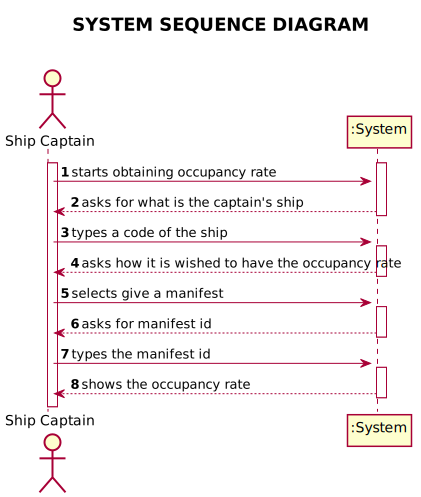
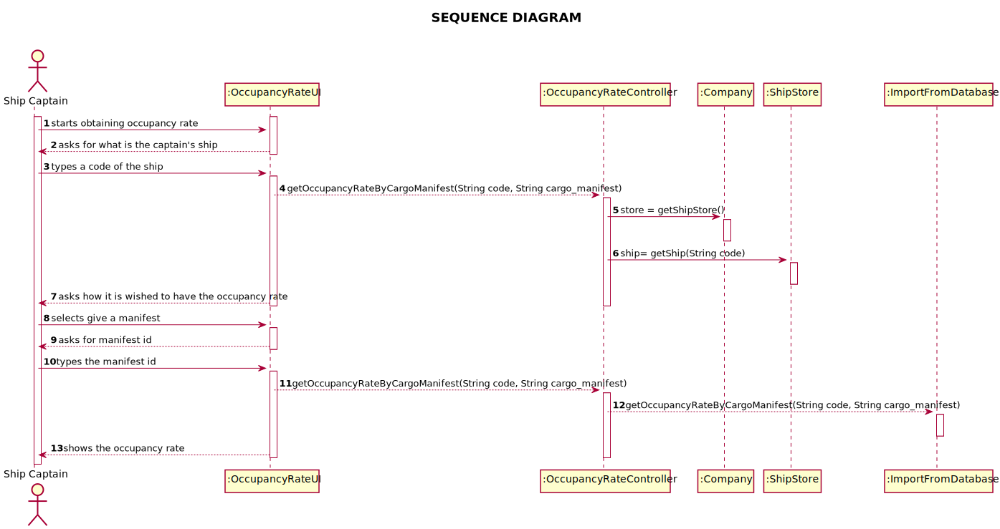
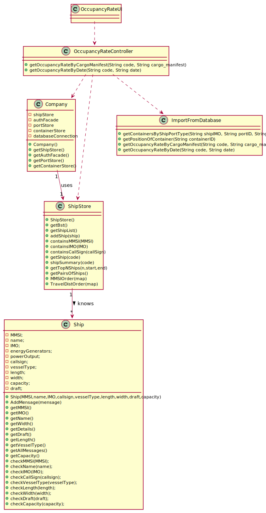

# US 201 - Occupancy rate of a ship

## 1. Requirements Engineering

### 1.1. User Story Description

*As Ship Captain, I want to know the occupancy rate (percentage) of a given ship
for a given cargo manifest. Occupancy rate is the ratio between total number of containers
in the ship coming from a given manifest and the total capacity of the ship, i.e., the
maximum number of containers the ship can load.*

### 1.2. System Sequence Diagram (SSD)

*Insert here a SSD depicting the envisioned Actor-System interactions and throughout which data is inputted and outputted to fulfill the requirement. All interactions must be numbered.*

## 2. Design - User Story Realization

## 2.1. Sequence Diagram (SD)

*In this section, it is suggested to present an UML dynamic view stating the sequence of domain related software objects' interactions that allows to fulfill the requirement.*

## 2.2. Class Diagram (CD)

*In this section, it is suggested to present an UML static view representing the main domain related software classes that are involved in fulfilling the requirement as well as and their relations, attributes and methods.*

# 3. Implementation

       public static double getOccupancyRateByCargoManifest(String code, String cargo_manifest) {
        try {
            Ship ship = App.getInstance().getCompany().getShipStore().getShip(code);
            String shipIMO = ship.getIMO();
            String sql = "SELECT * FROM cargo_manifest WHERE shipimo = '" + shipIMO + "' AND ID = '" + cargo_manifest + "'";
            ResultSet rs = App.getInstance().getCompany().getStatement().executeQuery(sql);
            if (rs.next()) {
                if (rs.getString("type").equals("TO BE OFFLOADED")) {
                    sql = selectCargoCont + cargo_manifest + "'";
                    rs = App.getInstance().getCompany().getStatement().executeQuery(sql);
                    int count = 0;
                    List<String> containersList = new ArrayList<>();
                    while (rs.next()) {
                        containersList.add(String.valueOf(rs.getInt("containerID")));
                    }
                    int sum = 0;
                    for (String container_id : containersList) {
                        sql = "SELECT * FROM CONTAINER WHERE ID = " + container_id;
                        rs = App.getInstance().getCompany().getStatement().executeQuery(sql);

                        ISO_CODE iso = null;
                        if (rs.next()) {
                            iso = ISO_CODE.fromString(rs.getString("iso_code"));
                        }
                        double sizex = iso.getSizeX();
                        double sizey = iso.getSizeY();
                        double sizez = iso.getSizeZ();
                        double volume = sizex * sizey * sizez;
                        sum += volume;
                    }
                    return (sum / Double.parseDouble(ship.getCapacity())) * 100;
                }
            }
        } catch (Exception ignored) {
        }
        throw new IllegalArgumentException("No Container with given the data in database :((");
    }

}