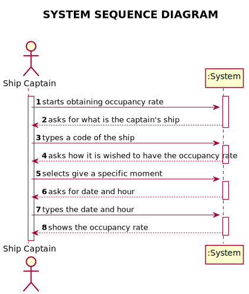
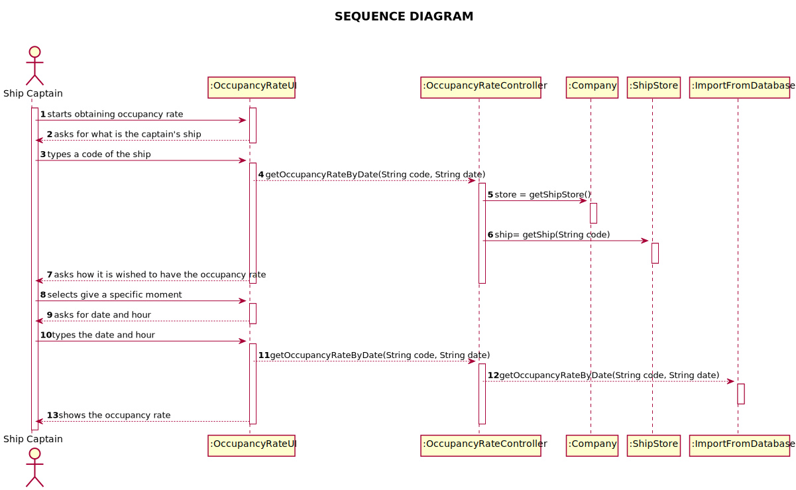
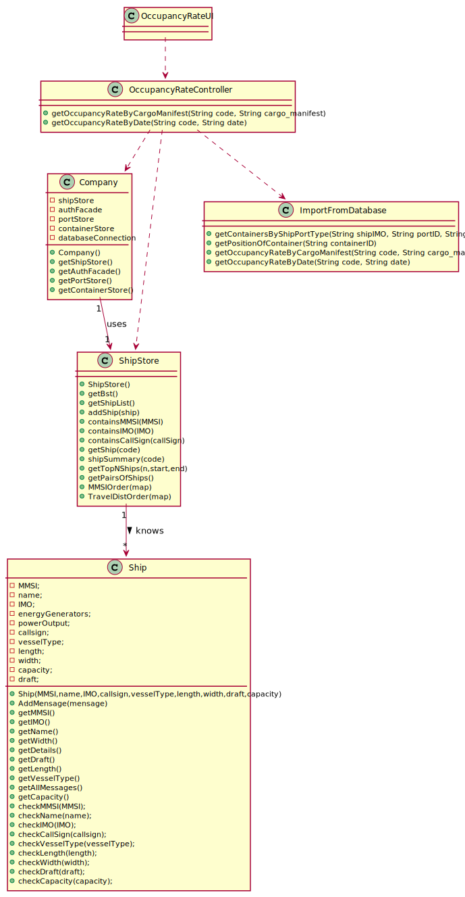

# US 201 - Occupancy rate of a ship in a given moment

## 1. Requirements Engineering

### 1.1. User Story Description

*As Ship Captain, I want to know the occupancy rate of a given ship at a given
moment.*

### 1.2. System Sequence Diagram (SSD)

*Insert here a SSD depicting the envisioned Actor-System interactions and throughout which data is inputted and outputted to fulfill the requirement. All interactions must be numbered.*

## 2. Design - User Story Realization

## 2.1. Sequence Diagram (SD)

*In this section, it is suggested to present an UML dynamic view stating the sequence of domain related software objects' interactions that allows to fulfill the requirement.*

## 2.2. Class Diagram (CD)

*In this section, it is suggested to present an UML static view representing the main domain related software classes that are involved in fulfilling the requirement as well as and their relations, attributes and methods.*

# 3. Implementation

       public static double getOccupancyRateByDate(String code, String date) {
        try {
            Ship ship = App.getInstance().getCompany().getShipStore().getShip(code);
            String shipIMO = ship.getIMO();
            String sql = selectCargoMani + shipIMO + "' AND base_date_time = '" + date + "'";
            ResultSet rs = App.getInstance().getCompany().getStatement().executeQuery(sql);
            if (rs.next()) {
                if (rs.getString("type").equals("TO BE OFFLOADED")) {
                    sql = selectCargoCont + rs.getString("id") + "'";
                    rs = App.getInstance().getCompany().getStatement().executeQuery(sql);
                    int count = 0;
                    List<String> containersList = new ArrayList<>();
                    while (rs.next()) {
                        containersList.add(String.valueOf(rs.getInt("containerID")));
                    }
                    double sum = 0;
                    for (String container_id : containersList) {
                        sql = "SELECT * FROM CONTAINER WHERE ID = " + container_id;
                        rs = App.getInstance().getCompany().getStatement().executeQuery(sql);

                        ISO_CODE iso = null;
                        if (rs.next()) {
                            iso = ISO_CODE.fromString(rs.getString("iso_code"));
                        }

                        double sizex = iso.getSizeX();
                        double sizey = iso.getSizeY();
                        double sizez = iso.getSizeZ();
                        double volume = sizex * sizey * sizez;
                        sum += volume;
                    }
                    try {
                        return (sum / Double.parseDouble(ship.getCapacity())) * 100;
                    } catch (Exception e) {
                        System.out.println(TextUtils.ANSI_RED + "\nShip Capacity " + ship.getCapacity() + " is invalid!" + TextUtils.ANSI_BLUE);
                    }

                }
            } else {
                throw new IllegalArgumentException("No Container with given the data in database :((");
            }
        } catch (Exception ignored) {
        }
        return 0;
    }

}