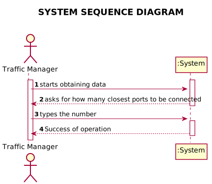
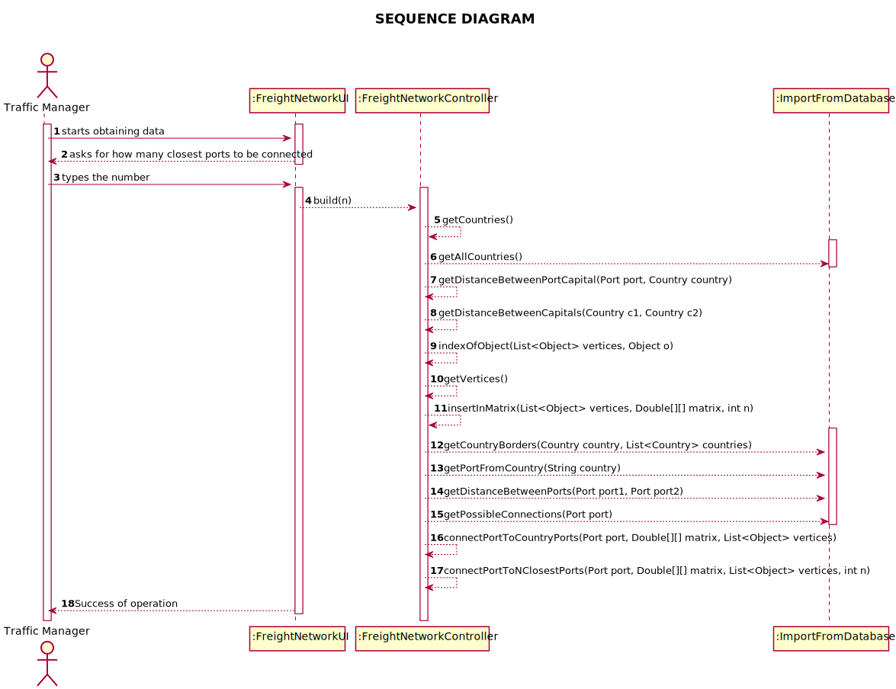
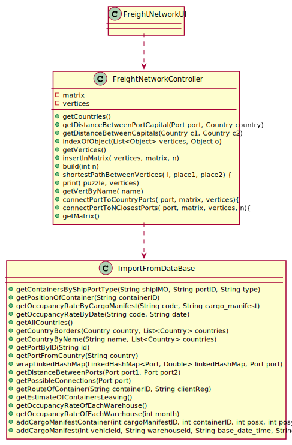

# US 301 - Freight Network

## 1. Requirements Engineering

### 1.1. User Story Description

*As a Traffic manager, I which to import data from countries, ports, borders and
seadists from the database to build a freight network.*

### 1.2. System Sequence Diagram (SSD)

*Insert here a SSD depicting the envisioned Actor-System interactions and throughout which data is inputted and outputted to fulfill the requirement. All interactions must be numbered.*

## 2. Design - User Story Realization

## 2.1. Sequence Diagram (SD)

*In this section, it is suggested to present an UML dynamic view stating the sequence of domain related software objects' interactions that allows to fulfill the requirement.*

## 2.2. Class Diagram (CD)

*In this section, it is suggested to present an UML static view representing the main domain related software classes that are involved in fulfilling the requirement as well as and their relations, attributes and methods.*

# 3. Implementation

## INSERT IN THE MATRIX
       public int insertInMatrix(List<Object> vertices, Double[][] matrix, int n) {
        int counter = 0;
        List<Country> countryList = getCountries();

        for (Country c : countryList) {
            List<Country> borders = ImportFromDataBase.getCountryBorders(c, countryList);
            Capital countryCapital = new Capital(c.getCountryName(), c.getContinent(), c.getCapital(), c.getLatitude(), c.getLongitude());
            int column = indexOfObject(vertices, countryCapital);
            int line = 0;
            for (Country b : borders) {
                Capital borderCapital = new Capital(b.getCountryName(), b.getContinent(), b.getCapital(), b.getLatitude(), b.getLongitude());
                double distanceToCapital = getDistanceBetweenCapitals(c, b);
                line = indexOfObject(vertices, borderCapital);
                matrix[line][column] = distanceToCapital;
                matrix[column][line] = distanceToCapital;
                counter++;
            }
            List<Port> ports = ImportFromDataBase.getPortFromCountry(c.getCountryName());
            LinkedHashMap<Double, Port> distancePortCapitals = new LinkedHashMap<>();
            for (Port port : ports) {
                double distancePortCapital = getDistanceBetweenPortCapital(port, c);
                distancePortCapitals.put(distancePortCapital, port);

                connectPortToCountryPorts(port, matrix, vertices);
                connectPortToNClosestPorts(port, matrix, vertices, n);

            }
            if (!distancePortCapitals.keySet().isEmpty()) {
                List<Double> dist = new ArrayList<Double>(distancePortCapitals.keySet());
                Collections.sort(dist);
                double minDistance = dist.get(0);
                line = indexOfObject(vertices, distancePortCapitals.get(minDistance));
                matrix[line][column] = minDistance;
                matrix[column][line] = minDistance;
                counter++;
            }
        }
        return counter;
    }

##BUILD
    public int build(int n) {
    vertices = (ArrayList<Object>) getVertices();
    matrix = new Double[vertices.size()][vertices.size()];
    insertInMatrix(vertices, matrix, n);
    print(matrix, vertices);
    return matrix.length;
    }

}