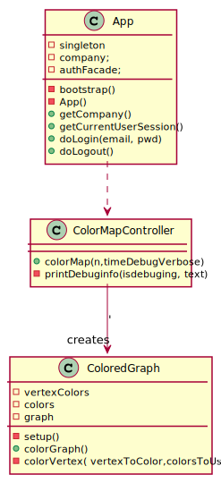

# US 302 - Color the graph

## 1. Requirements Engineering

### 1.1. User Story Description

* As a Traffic manager I wish to colour the map using as few colours as possible.*

### 1.2. System Sequence Diagram (SSD)

*Insert here a SSD depicting the envisioned Actor-System interactions and throughout which data is inputted and outputted to fulfill the requirement. All interactions must be numbered.*

## 3. Design - User Story Realization

## 3.1. Sequence Diagram (SD)

*In this section, it is suggested to present an UML dynamic view stating the sequence of domain related software objects' interactions that allows to fulfill the requirement.*

## 3.2. Class Diagram (CD)

*In this section, it is suggested to present an UML static view representing the main domain related software classes that are involved in fulfilling the requirement as well as and their relations, attributes and methods.*

# 4. Tests

**Test 1:** Tests the class with a random graph.

    void colorGraph() {

        ArrayList<String> vertices = new ArrayList<String>();
        vertices.add("A");
        vertices.add("B");
        vertices.add("C");
        vertices.add("D");
        vertices.add("E");
        vertices.add("F");
        vertices.add("G");
        Integer[][] a = {
                //A  B  C  D  E  F   G
                {1, 1, 1, 1, null, null, null}, // A
                {1, null, null, null, null, null, null}, // B
                {1, null, 1, 1, null, 1, 1}, // c
                {1, null, 1, 1, null, null, null}, // D
                {null, null, null, null, 1, 1, null}, // E
                {null, null, 1, null, 1, 1, null}, // F
                {null, null, 1, null, null, null, 1} // G
        };
        MatrixGraph<String, Integer> ab = new MatrixGraph<>(false, vertices, a);
        MapGraph<String, Integer> mg = new MapGraph<>(ab);

        ColoredGraph<String, Integer> cg = new ColoredGraph<>(mg);
        HashMap<String, Integer> test = new HashMap<>();
        test.put("A", 1);
        test.put("B", 2);
        test.put("C", 2);
        test.put("D", 3);
        test.put("E", 1);
        test.put("F", 3);
        test.put("G", 1);
        assertTrue(cg.colorGraph().equals(test));
    }
}

