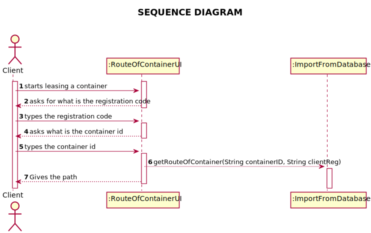

# US 305 - Route of Container

## 1. Requirements Engineering

### 1.1. User Story Description

*As Client, I want to know the route of a specific container I am leasing.*

### 1.2. System Sequence Diagram (SSD)

*Insert here a SSD depicting the envisioned Actor-System interactions and throughout which data is inputted and outputted to fulfill the requirement. All interactions must be numbered.*

## 2. Design - User Story Realization

## 2.1. Sequence Diagram (SD)

*In this section, it is suggested to present an UML dynamic view stating the sequence of domain related software objects' interactions that allows to fulfill the requirement.*

## 2.2. Class Diagram (CD)

*In this section, it is suggested to present an UML static view representing the main domain related software classes that are involved in fulfilling the requirement as well as and their relations, attributes and methods.*

# 3. Implementation

    public static String getRouteOfContainer(String containerID, String clientReg) {
    String mCount = null;
    try {
    try (CallableStatement stm = App.getInstance().getCompany().getStatement().getConnection().prepareCall("{ ?=call getrouteofcontainer(?,?) }")) {
    stm.registerOutParameter(1, Types.VARCHAR);
    stm.setInt(2, Integer.parseInt(containerID));
    stm.setInt(3, Integer.parseInt(clientReg));
    stm.executeUpdate();
    mCount = stm.getString(1);
    }
    } catch (Exception e) {
    print(e.getMessage());
    }
    return mCount;
    }