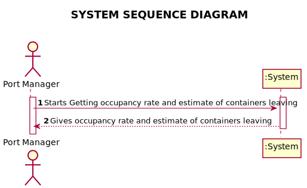
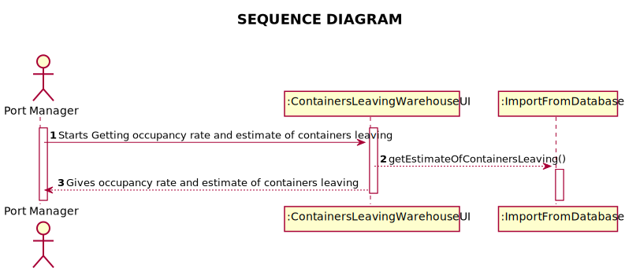
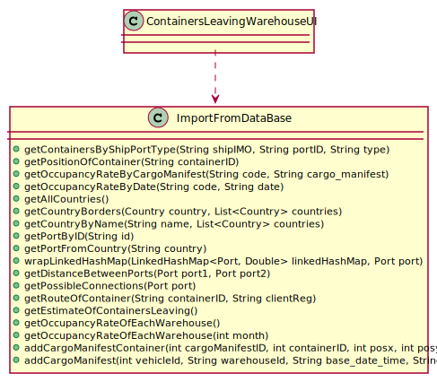

# US 306 - Occupancy Rate and Containers Leaving

## 1. Requirements Engineering

### 1.1. User Story Description

*As Port manager, I want to know the occupancy rate of each warehouse and an
estimate of the containers leaving the warehouse during the next 30 days.*

### 1.2. System Sequence Diagram (SSD)

*Insert here a SSD depicting the envisioned Actor-System interactions and throughout which data is inputted and outputted to fulfill the requirement. All interactions must be numbered.*

## 2. Design - User Story Realization

## 2.1. Sequence Diagram (SD)

*In this section, it is suggested to present an UML dynamic view stating the sequence of domain related software objects' interactions that allows to fulfill the requirement.*

## 2.2. Class Diagram (CD)

*In this section, it is suggested to present an UML static view representing the main domain related software classes that are involved in fulfilling the requirement as well as and their relations, attributes and methods.*

# 3. Implementation

     public static String getEstimateOfContainersLeaving() {
        String mCount = null;
        try {
            String email = App.getInstance().getCompany().getAuthFacade().getCurrentUserSession().getUserId().getEmail();
            CallableStatement stm = App.getInstance().getCompany().getStatement().getConnection().prepareCall("{ ?=call getEstimateOfContainersLeaving(?) }");
            stm.registerOutParameter(1, Types.VARCHAR);
            stm.setString(2, email);
            stm.executeUpdate();
            mCount = stm.getString(1);
            stm.close();
        } catch (Exception e) {
            System.out.println(e.getMessage());
        }
        return mCount;
    }

    /**
     * This method calls a function from the DataBase to get the occupancy rate of each warehouse
     * @return string with the occupancy rates
     */
    public static String getOccupancyRateOfEachWarehouse() {
        String mCount = null;
        try {
            String email = App.getInstance().getCompany().getAuthFacade().getCurrentUserSession().getUserId().getEmail();
            try (CallableStatement stm = App.getInstance().getCompany().getStatement().getConnection().prepareCall("{ ?=call getOCCupancyRateWarehouses(?) }")) {
                stm.registerOutParameter(1, Types.VARCHAR);
                stm.setString(2, email);
                stm.executeUpdate();
                mCount = stm.getString(1);
            }
        } catch (Exception e) {
            print(e.getMessage());
        }
        return mCount;
    }

    /**
     * This method calls a function from the DataBase to get the occupancy rate of each warehouse in a month
     * @return string with the occupancy rates
     */
    public static String getOccupancyRateOfEachWarehouse(int month) {
        String mCount = null;
        try {
            String email = App.getInstance().getCompany().getAuthFacade().getCurrentUserSession().getUserId().getEmail();
            try (CallableStatement stm = App.getInstance().getCompany().getStatement().getConnection().prepareCall("{ ?=call getOCCupancyRateWarehousesMONTH(?, ?) }")) {
                stm.registerOutParameter(1, Types.VARCHAR);
                stm.setString(2, email);
                stm.setInt(3, month);
                stm.executeUpdate();
                mCount = stm.getString(1);
            }
        } catch (Exception e) {
            print(e.getMessage());
        }
        return mCount;
    }