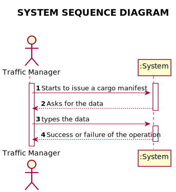
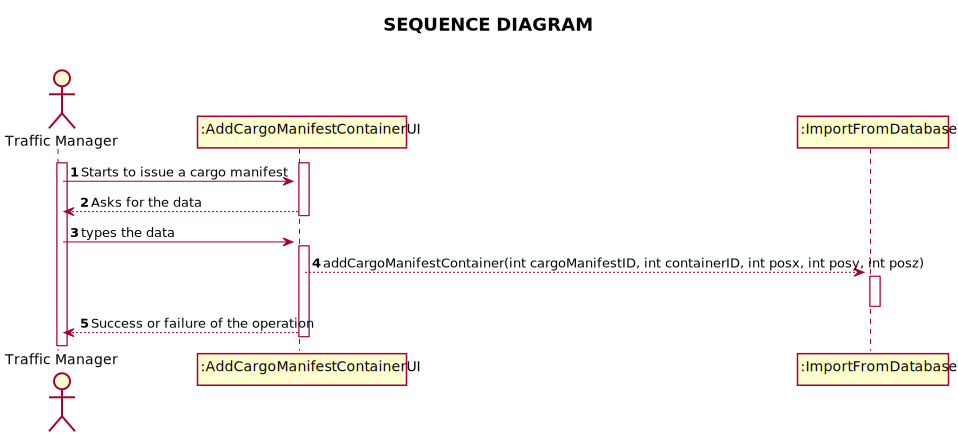
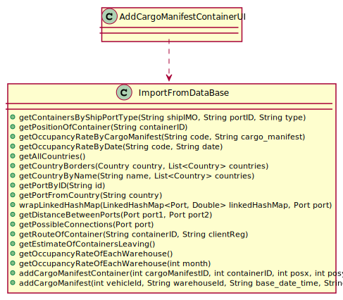

# US 308 - Containers Does not Exceed Ship's Capacity

## 1. Requirements Engineering

### 1.1. User Story Description

*As Traffic manager, I want to have a system that ensures that the number of
containers in a manifest does not exceed the ship's available capacity.*

### 1.2. System Sequence Diagram (SSD)

*Insert here a SSD depicting the envisioned Actor-System interactions and throughout which data is inputted and outputted to fulfill the requirement. All interactions must be numbered.*

## 2. Design - User Story Realization

## 2.1. Sequence Diagram (SD)

*In this section, it is suggested to present an UML dynamic view stating the sequence of domain related software objects' interactions that allows to fulfill the requirement.*

## 2.2. Class Diagram (CD)

*In this section, it is suggested to present an UML static view representing the main domain related software classes that are involved in fulfilling the requirement as well as and their relations, attributes and methods.*

# 3. Implementation

     public static String addCargoManifestContainer(int cargoManifestID, int containerID, int posx, int posy, int posz){
        String ret = null;
        try {
            String query = "INSERT INTO CARGO_MANIFEST_CONTAINER(CARGO_MANIFESTID, CONTAINERID, POSX, POSY, POSZ) VALUES (?, ?, ?, ?, ?)";

            Connection connection = null;
            PreparedStatement statement;

            try {
                connection = App.getInstance().getCompany().getDatabaseConnection().getConnection();
                connection.setAutoCommit(false);
                statement = connection.prepareStatement(query);

                statement.setInt(1, cargoManifestID);
                statement.setInt(2, containerID);
                statement.setInt(3, posx);
                statement.setInt(4, posy);
                statement.setInt(5, posz);
                statement.addBatch();

                statement.executeBatch();
                connection.commit();
            } catch (SQLException e) {
                try { connection.rollback(); } catch (SQLException ignored) {}
                ret = e.getMessage();
            }

        }catch (Exception e){
            ret = e.getMessage();
        }
        return ret;
    }
