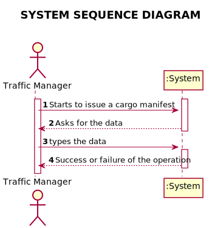
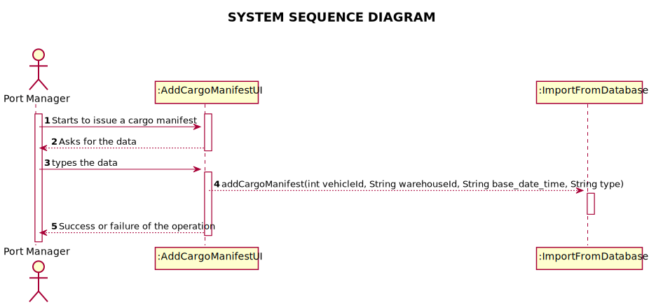
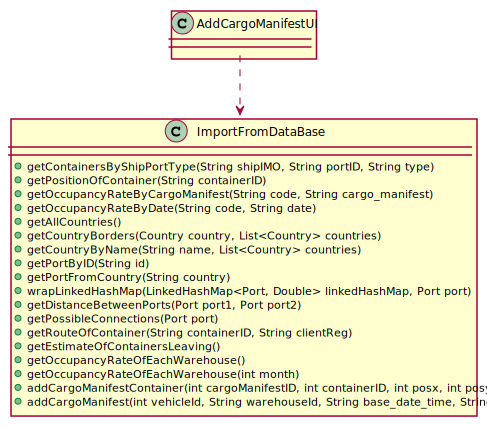

# US 309 - Cargo Manifest on a Date where Ship is Occupied

## 1. Requirements Engineering

### 1.1. User Story Description

*As Traffic manager, I do not allow a cargo manifest for a particular ship to be
registered in the system on a date when the ship is already occupied.*

### 1.2. System Sequence Diagram (SSD)

*Insert here a SSD depicting the envisioned Actor-System interactions and throughout which data is inputted and outputted to fulfill the requirement. All interactions must be numbered.*

## 2. Design - User Story Realization

## 2.1. Sequence Diagram (SD)

*In this section, it is suggested to present an UML dynamic view stating the sequence of domain related software objects' interactions that allows to fulfill the requirement.*

## 2.2. Class Diagram (CD)

*In this section, it is suggested to present an UML static view representing the main domain related software classes that are involved in fulfilling the requirement as well as and their relations, attributes and methods.*

# 3. Implementation

     public static String addCargoManifest(int vehicleId, String warehouseId, String baseDateTime, String type){
        String ret = null;
        try {
            String query = "INSERT INTO CARGO_MANIFEST(VEHICLEID, WAREHOUSEID, BASE_DATE_TIME, TYPE) VALUES (?, ?, ?, ?)";

            Connection connection = null;
            PreparedStatement statement;

            try {
                connection = App.getInstance().getCompany().getDatabaseConnection().getConnection();
                connection.setAutoCommit(false);
                statement = connection.prepareStatement(query);

                statement.setInt(1, vehicleId);
                statement.setString(2, warehouseId);
                statement.setString(3, baseDateTime);
                statement.setString(4, type);
                statement.addBatch();

                statement.executeBatch();
                connection.commit();
            } catch (SQLException e) {
                try { connection.rollback(); } catch (SQLException ignored) {}
                ret = e.getMessage();
            }

        }catch (Exception e){
            ret = e.getMessage();
        }
        return ret;
    }
