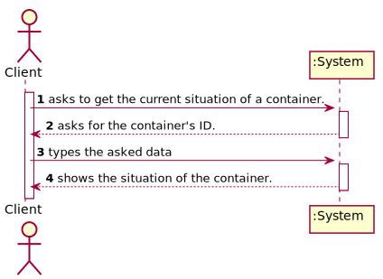
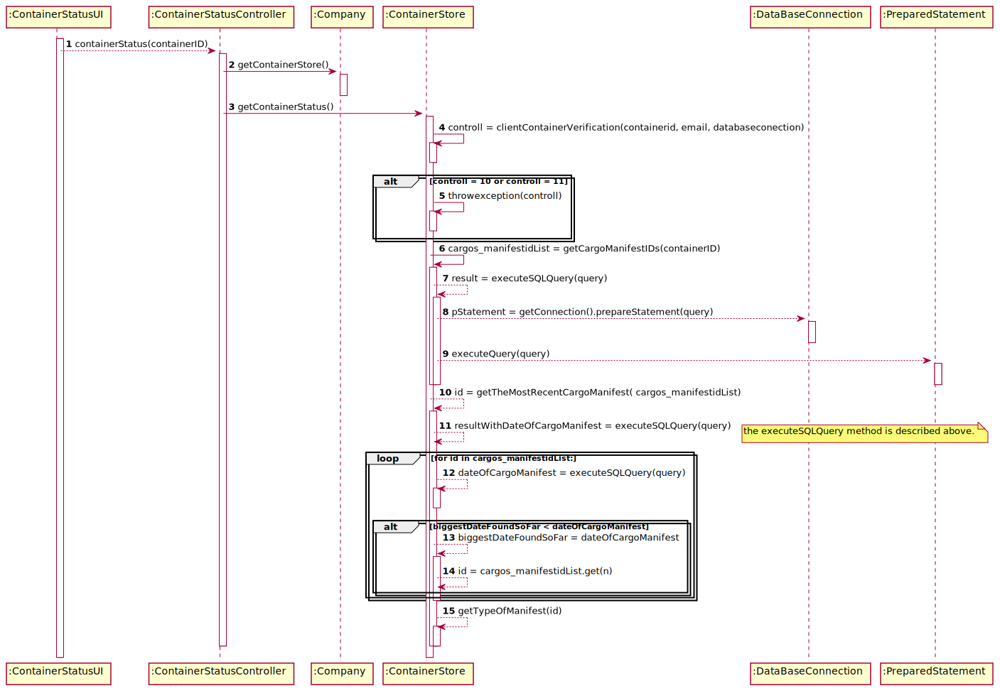
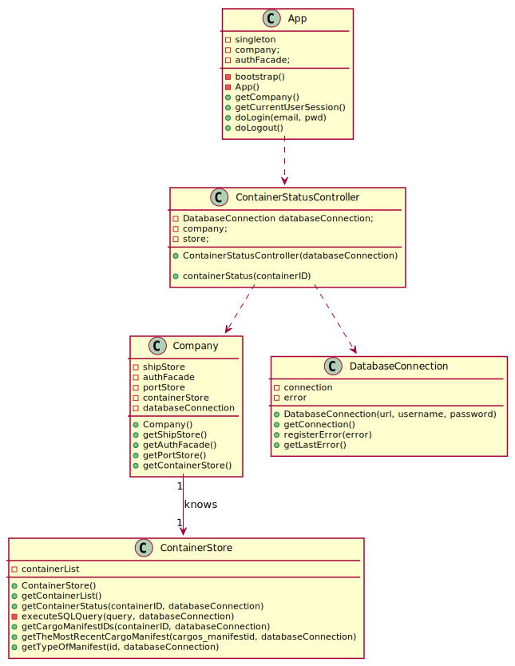

# US 202 - Get the situation of a container

## 1. Requirements Engineering

### 1.1. User Story Description

*As Client, I want to know the current situation of a specific container being used
to transport my goods – US312*

### 1.2. System Sequence Diagram (SSD)

*Insert here a SSD depicting the envisioned Actor-System interactions and throughout which data is inputted and outputted to fulfill the requirement. All interactions must be numbered.*

## 3. Design - User Story Realization

## 3.1. Sequence Diagram (SD)

*In this section, it is suggested to present an UML dynamic view stating the sequence of domain related software objects' interactions that allows to fulfill the requirement.*

## 3.2. Class Diagram (CD)

*In this section, it is suggested to present an UML static view representing the main domain related software classes that are involved in fulfilling the requirement as well as and their relations, attributes and methods.*

# 4. Tests

**Test 1:** Checks the status for a container in a truck
        
        @Test
        void containerStatusTruck() throws SQLException {
        //test Truck
        ResultSet rs = mock(ResultSet.class);
        ContainerStatusController c = new ContainerStatusController(databaseConnection);
        CallableStatement cs = mock(CallableStatement.class);

        //validation container
        when(databaseConnection.getConnection()).thenReturn(connection);
        when(databaseConnection.getConnection().prepareCall(anyString())).thenReturn(cs);
        when(cs.getInt(anyInt())).thenReturn(1);

        when(databaseConnection.getConnection()).thenReturn(connection);
        when(databaseConnection.getConnection().prepareStatement(anyString())).thenReturn(s);
        when(rs.next()).thenReturn(true).thenReturn(false).thenReturn(true);
        when(s.executeQuery(anyString())).thenReturn(rs);
        when(rs.getString(eq("cargo_manifestid"))).thenReturn("123456");
        when(rs.getString(eq("BASE_DATE_TIME"))).thenReturn("2020-01-18 18:32");
        when(rs.getString(eq("TYPE"))).thenReturn("TO BE LOADED").thenReturn("TRUCK");
        when(rs.getString(eq("VEHICLEID"))).thenReturn("12345");
        when(rs.getString(eq("ID"))).thenReturn("112314");

        //System.out.println(c.containerStatus("1111"));
        assertTrue("TRUCK, 112314".equals(c.containerStatus("1111")));

    }
**Test 2:** Checks the status for a container in a port

    @Test
    void containerStatusPort() throws SQLException {
        //test Port
        ResultSet rs = mock(ResultSet.class);
        ContainerStatusController c = new ContainerStatusController(databaseConnection);
        CallableStatement cs = mock(CallableStatement.class);

        //validation container
        when(databaseConnection.getConnection()).thenReturn(connection);
        when(databaseConnection.getConnection().prepareCall(anyString())).thenReturn(cs);
        when(cs.getInt(anyInt())).thenReturn(1);

        when(databaseConnection.getConnection()).thenReturn(connection);
        when(databaseConnection.getConnection().prepareStatement(anyString())).thenReturn(s);
        when(rs.next()).thenReturn(true).thenReturn(false).thenReturn(true);
        when(s.executeQuery(anyString())).thenReturn(rs);
        when(rs.getString(eq("cargo_manifestid"))).thenReturn("123456");
        when(rs.getString(eq("BASE_DATE_TIME"))).thenReturn("2020-01-18 18:32");
        when(rs.getString(eq("TYPE"))).thenReturn("TO BE OFFLOADED");
        when(rs.getString(eq("PORTID"))).thenReturn("12345");
        when(rs.getString(eq("NAME"))).thenReturn("Cheiro do atlântico");

        //System.out.println(c.containerStatus("1111"));
        assertTrue("PORT, Cheiro do atlântico".equals(c.containerStatus("1111")));
    }
**Test 3:** Checks the status for a container in a warehouse

    @Test
    void containerStatusWarehouse() throws SQLException {
        //test Port
        ResultSet rs = mock(ResultSet.class);
        ContainerStatusController c = new ContainerStatusController(databaseConnection);
        CallableStatement cs = mock(CallableStatement.class);

        //validation container
        when(databaseConnection.getConnection()).thenReturn(connection);
        when(databaseConnection.getConnection().prepareCall(anyString())).thenReturn(cs);
        when(cs.getInt(anyInt())).thenReturn(1);

        when(databaseConnection.getConnection()).thenReturn(connection);
        when(databaseConnection.getConnection().prepareStatement(anyString())).thenReturn(s);
        when(rs.next()).thenReturn(true).thenReturn(false).thenReturn(true);
        when(s.executeQuery(anyString())).thenReturn(rs);
        when(rs.getString(eq("cargo_manifestid"))).thenReturn("123456");
        when(rs.getString(eq("BASE_DATE_TIME"))).thenReturn("2020-01-18 18:32");
        when(rs.getString(eq("TYPE"))).thenReturn("TO BE OFFLOADED");
        when(rs.getString(eq("WAREHOUSEID"))).thenReturn("12345");
        when(rs.getString(eq("ID"))).thenReturn("113253");

        assertTrue("WAREHOUSE, 113253".equals(c.containerStatus("1111")));
    }.
**Test 4:** Checks the error message for a invalid client

    @Test
    void containerStatusInvalidClient() throws SQLException {

        ContainerStatusController c = new ContainerStatusController(databaseConnection);
        CallableStatement cs = mock(CallableStatement.class);

        when(databaseConnection.getConnection()).thenReturn(connection);
        when(databaseConnection.getConnection().prepareCall(anyString())).thenReturn(cs);
        when(cs.getInt(anyInt())).thenReturn(11);
        IllegalArgumentException thrown = assertThrows(
                IllegalArgumentException.class,
                () -> c.containerStatus("1111")
        );
        assertTrue(thrown.getMessage().equals("11 – container is not leased by client"));

    }
**Test 5:** Checks the error message for a invalid container

    @Test
    void containerStatusInvalidContainer() throws SQLException {

        ContainerStatusController c = new ContainerStatusController(databaseConnection);
        CallableStatement cs = mock(CallableStatement.class);

        when(databaseConnection.getConnection()).thenReturn(connection);
        when(databaseConnection.getConnection().prepareCall(anyString())).thenReturn(cs);
        when(cs.getInt(anyInt())).thenReturn(10);
        IllegalArgumentException thrown = assertThrows(
                IllegalArgumentException.class,
                () -> c.containerStatus("1111")
        );
        assertTrue(thrown.getMessage().equals("10 – invalid container id"));

    }
}

