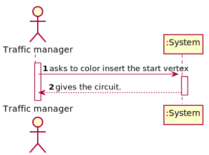
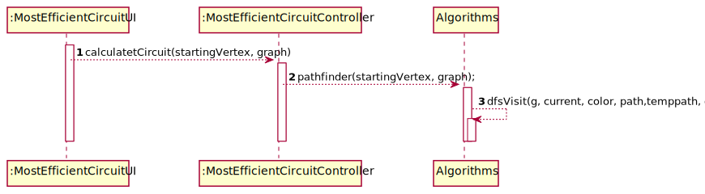
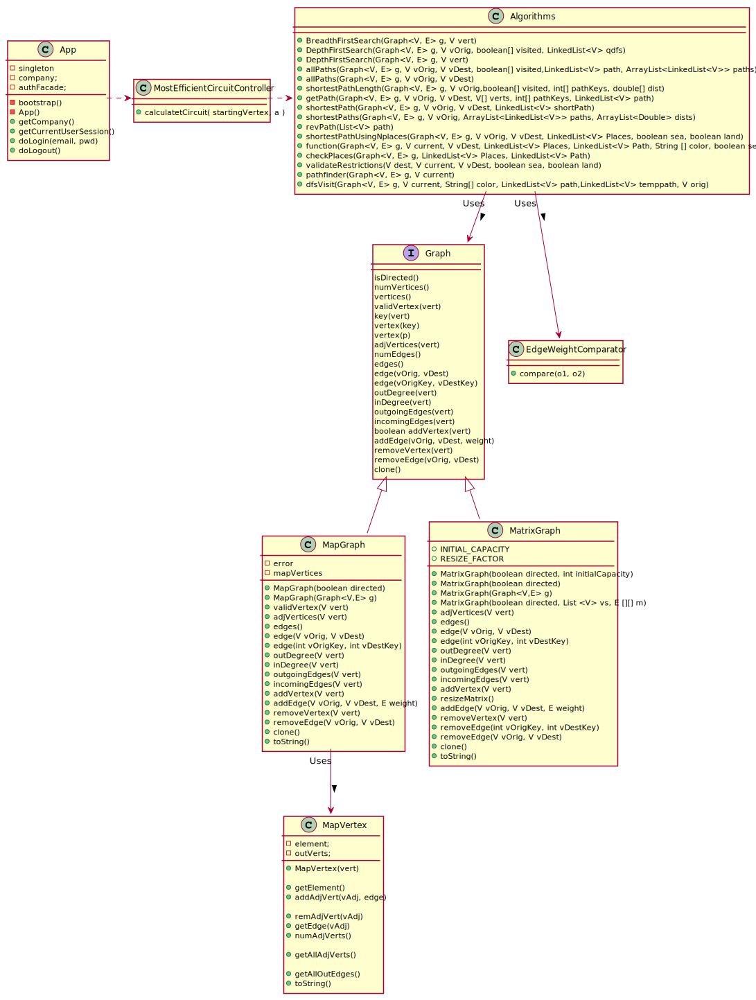

# US 403 - Most efficient circuit

## 1. Requirements Engineering

### 1.1. User Story Description

*] As a Traffic manager I wish to know the most efficient circuit that starts from a
source location and visits the greatest number of other locations once, returning to the
starting location and with the shortest total distance.*
### 1.2. System Sequence Diagram (SSD)

*Insert here a SSD depicting the envisioned Actor-System interactions and throughout which data is inputted and outputted to fulfill the requirement. All interactions must be numbered.*

## 3. Design - User Story Realization

## 3.1. Sequence Diagram (SD)

*In this section, it is suggested to present an UML dynamic view stating the sequence of domain related software objects' interactions that allows to fulfill the requirement.*

## 3.2. Class Diagram (CD)

*In this section, it is suggested to present an UML static view representing the main domain related software classes that are involved in fulfilling the requirement as well as and their relations, attributes and methods.*

# 4. Tests

**Test 1:** Tests the class with a random graph.
      
        Integer[][] a = {
        // a  b  c  d  e  f  g
        {null, 1, 1, 3, null, 2, null},
        {1, null, null, 2, null, null, null},
        {1, null, null, 4, 1, 1, null},
        {3, 2, 4, null, null, null, null},
        {null, null, 1, null, null, null, null},
        {2, null, 1, null, null, null, 1},
        {null, null, null, null, null, 1, null}
        };
        

        ArrayList<String> vertices = new ArrayList<>();
        vertices.add("A");
        vertices.add("B");
        vertices.add("C");
        vertices.add("D");
        vertices.add("E");
        vertices.add("F");
        vertices.add("G");

        MatrixGraph<String, Integer> ab = new MatrixGraph<>(false, vertices, a);
        MapGraph<String, Integer> mg = new MapGraph<>(ab);

        LinkedList<String> expected = new LinkedList<>();
        expected.add("A");
        expected.add("B");
        expected.add("D");
        expected.add("C");
        expected.add("F");
        expected.add("A");
        assertEquals(Algorithms.pathfinder(mg, "A"), expected);

